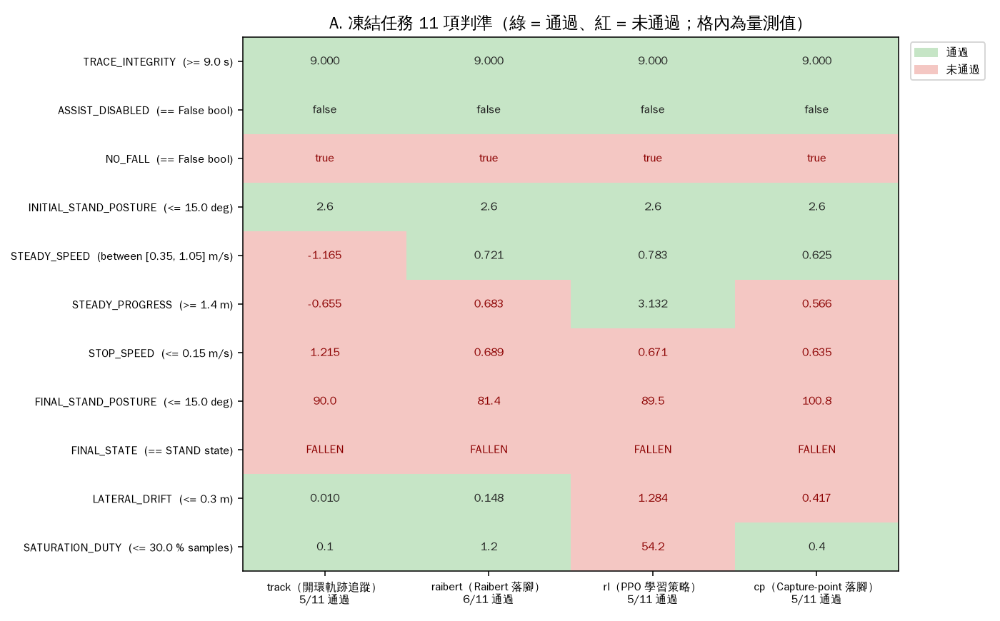
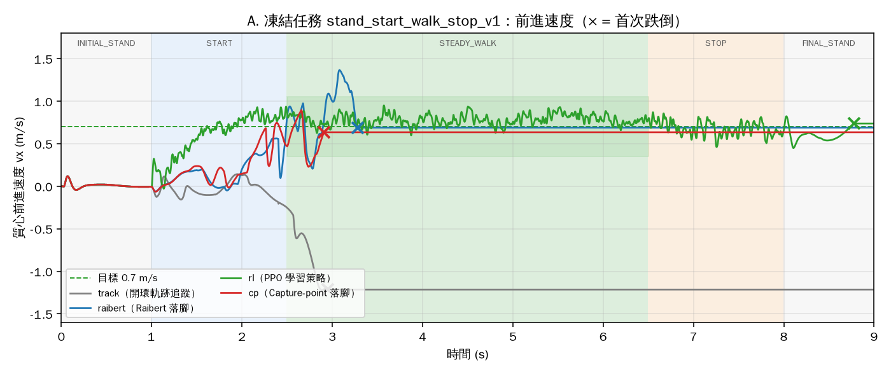
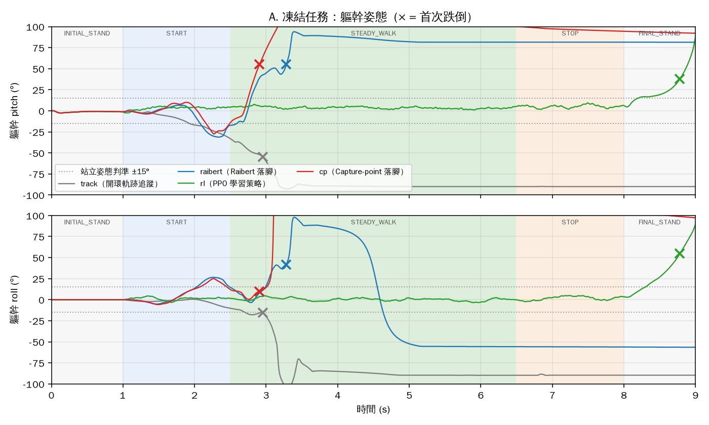
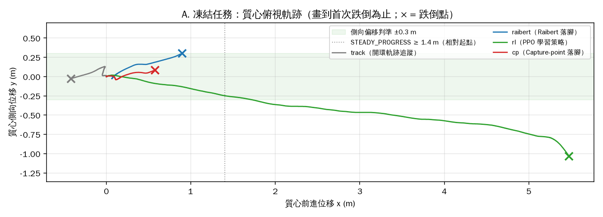
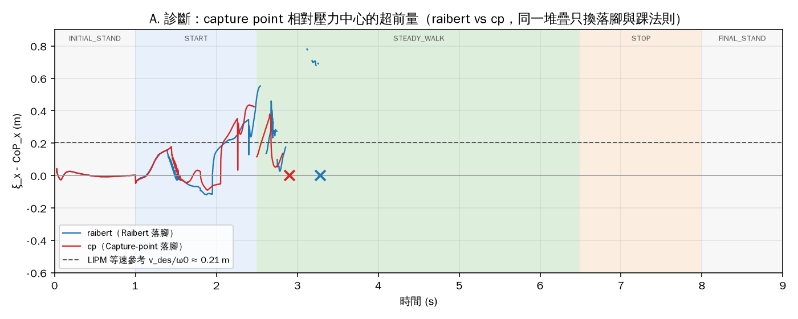
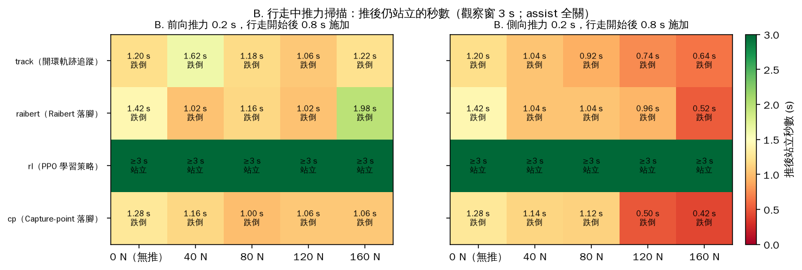
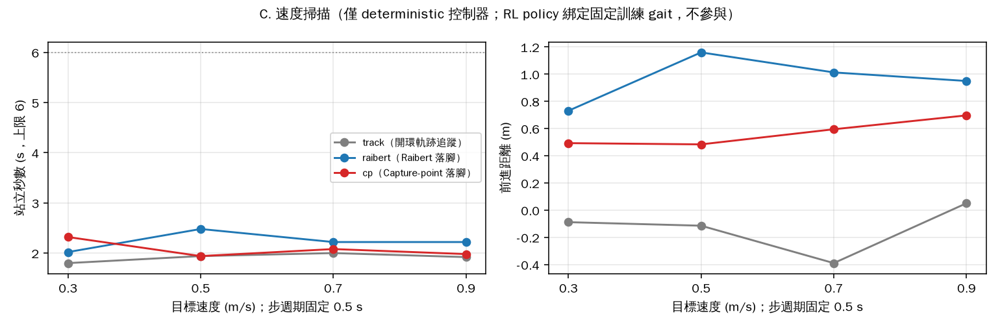

# 四個行走控制器的開發比較——含一個新加的 Capture-point 對照組

日期：2026-09-22 ｜ 任務 #102 ｜ 性質：**量測記錄，`DEVELOPMENT_COMPARISON_ONLY`**；不是控制器排名、
不是 V3 benchmark、不是實體能力 ｜ 受測工作樹：`2a2a9f8`（`main`，PR #48 合併後）加上本任務的變更；
每個控制器原始檔的 sha256 釘在 [`summary.json`](assets/controller-compare-2026-09-22/summary.json) 的 `code_sha256`

上游：[ROADMAP §2 M6 列](ROADMAP.md)（「deterministic nominal comparison／V3 NOT PASSED」）
｜ 任務契約：[`backend/motion_tasks.py`](../backend/motion_tasks.py)（位元組被釘住，未動）
｜ 圖與數據：[`docs/assets/controller-compare-2026-09-22/`](assets/controller-compare-2026-09-22/)

---

## 0. 一句話

**現有三個控制／學習方法沒有一個是新的，專案自己也沒這樣宣稱；我加的第四個（Capture-point 落腳）同樣不是新的，
而且在凍結任務上沒有比 Raibert 好——5/11 對 6/11，還早跌了 0.376 s。**
唯一能走完穩態段的是 PPO policy，但它在停步段跌倒、側向漂移 1.284 m、飽和佔比 54.2%，四個全部 `FAIL`。

---

## 1. 問題一：目前的學習或控制方法有創新嗎？

| 控制器 | 做法 | 出處／年代 | 這個 repo 裡有沒有加東西 |
|---|---|---|---|
| `track` | 開環步態軌跡 + 關節 PD，起步靠外加「起步輔助」力 | 教科書 | 沒有；ROADMAP 自己標它「開環時序」 |
| `raibert` | 觸地相位重置 + Raibert 落腳法則 `neutral + k_R·(v − v_des)` + 支撐腿任務空間 IK + PD + 重力前饋 + 髖／踝姿態修正 | Raibert 1986；髖／踝策略 1990s–2000s | 沒有新法則；是把幾個標準元件組成一個堆疊 |
| `rl`、`rl_task_v2`、`rl_task_v5` | PPO + 標準 reward shaping + curriculum；v5 把 path／heading／phase 放進觀測 | Schulman 2017；shaping／curriculum 為常規作法 | 沒有新演算法；是常規 PPO 訓練配方，checkpoint 由 registry 選定 |

**結論：沒有。** 三條都是教科書級方法的實作。專案**自己宣稱的**貢獻不在控制器：
[ROADMAP §2](ROADMAP.md) 把 M6 標為「SOFTWARE SNAPSHOT／V3 NOT PASSED」，
[STATUS.yaml](../STATUS.yaml) 的 `prohibited_claims` 明列 `general controller superiority`；
專案的研究主張在 **Track A——RL 評估效度（exposure censoring／partial identification）**，
見 [PUBLICATION_PLAN](PUBLICATION_PLAN.md) 與 [PROJECT_STATUS §4](PROJECT_STATUS.md)。
把控制器當成貢獻來寫會和專案自己的標籤矛盾。

---

## 2. 我加的方法：Capture-point／DCM 落腳——也不是新的

### 2.1 是什麼

[`backend/controller_cp.py`](../backend/controller_cp.py)，87 行。它繼承 `RaibertController`，
**只換兩個法則**，其餘（觸地相位重置、支撐腿 IK、擺動軌跡、PD＋重力前饋、髖修正、加速換步、
所有落點限制與末段鎖定）逐字沿用：

1. **落腳點**：不用 `neutral + k_R·(v − v_des)`，改放在瞬時 capture point `ξ = c + ċ/ω0` 後方一個固定 DCM 偏移處
   - `b_x = v_des·T / (e^{ω0·T} − 1)`（LIPM 等速步行的解析解）
   - `b_y = d_y / (e^{ω0·T} + 1)`，`d_y = 2·hw`（髖寬）
2. **踝策略**：不用速度誤差 `−70·(v − v_des)`，改用 CP 相對支撐腳的偏差 `e = (ξ_x − p_stance_x) − v_des/ω0`，
   輸出 `clip(−120·e, ±35 N·m)`

出處：capture point——Pratt, Carff, Drakunov, Goswami 2006；DCM 偏移解析式——Englsberger, Ott, Albu-Schäffer 2011／2015。
**這是把教科書上的模型式法則放進同一套堆疊，當 Raibert 啟發式的單因子對照組**，不是新方法。

### 2.2 事前定死的東西

- 增益寫死在 `controller_cp.GAINS`（踝 120 N·m/m、限幅 ±35 N·m、側向間距 2·hw），**在第一次執行前寫下，
  看到結果後沒有改**。這裡報的就是第一次執行的數字。若日後調整，需另立版本並揭露每一次迭代。
- 實驗 B、C 的常數（推力時點 0.8 s、0.2 s、觀察窗 3 s、五個力、四個速度、步週期 0.5 s）同樣寫死在 harness 頂端。

### 2.3 為了讓它能插進來，動了什麼

| 動作 | 驗證 |
|---|---|
| `RaibertController.compute()` 抽出三個 hook：`_foot_placement`、`_placement_note`、`_ankle_strategy`；預設實作 = 原公式 | 重跑凍結任務，**19 個 trace 陣列與重構前逐位元相同**，11 項判準值相同（跌倒 3.282 s、STEADY_PROGRESS 0.683458…）；`test_controller_cp.py` 另以裸物件斷言 hook 預設值等於舊公式 |
| `LiveSession` 的控制器切換抽成 `_switch_controller(kind)`；`mode` 指令與 motion-task candidate 都改走它 | `test_live_contract`／`test_motion_tasks`／`test_run_trace`／`test_compare_live`／`test_decision_kind` 46 項全過；`track`、`raibert` 的 `run_one` 結果與重構前相同 |
| `cp` 註冊進 `_make_controller`、`run_motion_task.SINGLE_CONTROLLERS`、`module_boundary_registry.json`（teaching 閉包 15 → 16 模組）、前端決策分類表 | `module_boundary_contract` → `MODULE_BOUNDARIES_CLEAN: teaching 16 modules/5066 lines` |

**`cp` 是 harness 專用、前端選不到。** 公開 `mode` 指令的控制器白名單是 `config_schema.py` 裡的 pydantic `Literal`，
而 `config_schema.py` 的位元組被兩份凍結 protocol 釘住（`training_seed_variance_protocol.json`、
`v7_action_interface_pilot_protocol.json` 的 `config_schema_source_sha256`），**不能增列**。
所以 `run_motion_task.switch_controller()` 對 `cp` 走 `LiveSession._switch_controller()`，
對其餘五個照走公開指令；`test_controller_cp.py` 同時斷言「公開指令拒絕 `cp`（`INVALID_COMMAND`）、內部切換成功」。

### 2.4 一個順帶量到的差異

`run_motion_task.run_one("track")` 與三機 `CompareSession`（`run_all`）對 `track` 的 STEADY_SPEED 差 `0.003 m/s`
（−1.164684 對 −1.167411），跌倒時間相同。**用 `git stash` 回到重構前的程式重跑，數字一樣**——
差異來自兩個 harness 建 session 的路徑不同（`run_one` 由預設 raibert session 切到 track；`CompareSession` 直接建），
不是本次變更造成。本報告四個控制器**一律用 `run_one` 的路徑**。

---

## 3. 怎麼測

[`backend/compare_controllers_report.py`](../backend/compare_controllers_report.py)，一個指令跑完，約 50 s。

| 實驗 | 設定 | 量什麼 |
|---|---|---|
| **A. 凍結任務** | `stand_start_walk_stop_v1`（9 s；站 1 s → 起步 1.5 s → 穩走 4 s → 停 1.5 s → 站 1 s；gait 0.7 m/s／0.35 m／duty 0.62／clearance 0.07；assist 強制關）。每個控制器一次，與 `run_one` 完全相同的路徑，500 Hz Dynamic Run Trace | 11 項判準（位元組釘住的契約）、首次跌倒時間、全程 trace |
| **B. 行走中推力** | 任務同一組 gait，`assist_balance` 與 `startup_assist_enabled` 全關，行走開始後 **0.8 s** 對軀幹施 **0.2 s** 水平力；前向（+x）與側向（+y）各 {0, 40, 80, 120, 160} N；觀察 3 s | 推後仍站立的秒數、是否跌倒、最大 pitch／roll |
| **C. 速度掃描** | 三個 deterministic 控制器；步週期固定 0.5 s（`step_length = 0.5·speed`），速度 {0.3, 0.5, 0.7, 0.9} m/s；assist 全關；觀察 6 s | 站立秒數、前進距離、步數 |

RL policy 綁定固定訓練 gait（runtime `gait` 指令回 `RUNTIME_GAIT_UNSUPPORTED`），所以**不參與 C**。
為什麼 B 推得這麼早：三個 deterministic 控制器在無推力下 **~2 s 內就自行跌倒**（見 §5 的 0 N 列），
推在 3 s 只會量到「推一個已經倒地的機器人」。這個選擇在看到任何推力結果前寫死。

模擬是 deterministic 的：同一份程式、同一組參數重跑，數字逐位相同（本報告重跑兩次確認）。
因此每格 n = 1 不是抽樣不足，而是**這個 plant 下的全部母體**；它量不到的是對 seed／plant 擾動的穩健性（§7）。

---

## 4. 結果 A：凍結任務——四個全 FAIL，CP 沒有贏過 Raibert

| 判準（門檻） | `track` | `raibert` | `rl` | **`cp`** |
|---|---|---|---|---|
| TRACE_INTEGRITY（≥ 9 s） | 9.000 ✓ | 9.000 ✓ | 9.000 ✓ | 9.000 ✓ |
| ASSIST_DISABLED（== false） | ✓ | ✓ | ✓ | ✓ |
| NO_FALL | **✗** | **✗** | **✗** | **✗** |
| INITIAL_STAND_POSTURE（≤ 15°） | 2.6 ✓ | 2.6 ✓ | 2.6 ✓ | 2.6 ✓ |
| STEADY_SPEED（0.35–1.05 m/s） | −1.165 **✗** | 0.721 ✓ | 0.783 ✓ | 0.625 ✓ |
| STEADY_PROGRESS（≥ 1.40 m） | −0.655 **✗** | 0.683 **✗** | 3.132 ✓ | 0.566 **✗** |
| STOP_SPEED（≤ 0.15 m/s） | 1.215 **✗** | 0.689 **✗** | 0.671 **✗** | 0.635 **✗** |
| FINAL_STAND_POSTURE（≤ 15°） | 90.0 **✗** | 81.4 **✗** | 89.5 **✗** | 100.8 **✗** |
| FINAL_STATE（== STAND） | FALLEN **✗** | FALLEN **✗** | FALLEN **✗** | FALLEN **✗** |
| LATERAL_DRIFT（≤ 0.30 m） | 0.010 ✓ | 0.148 ✓ | 1.284 **✗** | 0.417 **✗** |
| SATURATION_DUTY（≤ 30%） | 0.1 ✓ | 1.2 ✓ | 54.2 **✗** | 0.4 ✓ |
| **通過數** | **5/11** | **6/11** | **5/11** | **5/11** |
| **首次跌倒** | 2.952 s | 3.282 s | 8.780 s | **2.906 s** |









### 4.1 怎麼讀

- **`track` 往後走**：起步後 vx 一路變負到 −1.2 m/s，1.95 s 後倒下。開環參考不自洽，在任務裡起步輔助被強制關掉，這是預期中的失敗。
- **`raibert` 與 `cp` 倒在同一個窗口**（起步後 2.28 s 對 1.91 s）。CP 多失一項 LATERAL_DRIFT（0.417 m）：
  DCM 側向偏移把落腳放得比 Raibert 的 `hip_y + 0.5·T·v_y + k_R·v_y` 更靠中線，側向擾動抑制變差。前進速度 0.625 對 0.721，也慢。
- **`rl` 是唯一走完穩態段的**（3.13 m），但停步段沒停下來（0.671 m/s），在 FINAL_STAND 段 8.78 s 跌倒；
  側向漂移 1.284 m、飽和佔比 54.2%——這與 [PROJECT_STATUS §4.5](PROJECT_STATUS.md) 早已記錄的 legacy `rl` 行為一致。

### 4.2 一個診斷圖：換掉落腳法則沒有改變失敗時點



`ξ_x − CoP_x`（瞬時 capture point 相對壓力中心的超前量；LIPM 等速時應貼近 `v_des/ω0 ≈ 0.21 m`）。
Raibert 與 CP 的曲線在 **2.2 s 左右同時**離開參考帶、同樣在 2.6–2.8 s 衝到 0.4–0.55 m 後倒下。
**落腳法則是這兩者唯一的差異，而失敗時點沒有變**——這是一個假說的證據，不是結論：
瓶頸可能不在落腳，而在兩者共用的堆疊裡（觸地過渡、支撐腿伺服、或第 3–4 步的相位重置）。
§6 的速度掃描給了同方向的第二個訊號。

---

## 5. 結果 B：行走中推力——三個 deterministic 控制器連 0 N 都站不過 2 s

推後仍站立的秒數（觀察窗 3 s；「≥3」= 窗內未跌）：

| 控制器 | 方向 | 0 N（無推） | 40 N | 80 N | 120 N | 160 N |
|---|---|---|---|---|---|---|
| `track` | 前向 | 1.20 | 1.62 | 1.18 | 1.06 | 1.22 |
| `track` | 側向 | 1.20 | 1.04 | 0.92 | 0.74 | 0.64 |
| `raibert` | 前向 | 1.42 | 1.02 | 1.16 | 1.02 | 1.98 |
| `raibert` | 側向 | 1.42 | 1.04 | 1.04 | 0.96 | 0.52 |
| `rl` | 前向 | **≥3** | **≥3** | **≥3** | **≥3** | **≥3** |
| `rl` | 側向 | **≥3** | **≥3** | **≥3** | **≥3** | **≥3** |
| **`cp`** | 前向 | 1.28 | 1.16 | 1.00 | 1.06 | 1.06 |
| **`cp`** | 側向 | 1.28 | 1.14 | 1.12 | **0.50** | **0.42** |



- **0 N 那一欄就是答案的大半**：`track`、`raibert`、`cp` 在無推力下分別於行走開始後 2.00、2.22、2.08 s 倒下，
  與 A 的跌倒時點一致（A 的行走從 1.0 s 開始）。推力只是讓一個本來就要倒的機器人早一點倒。
- **`rl` 在 160 N × 0.2 s（32 N·s 衝量）前向與側向都沒倒**，窗內站滿 3 s。這是 3 s 觀察窗內的結果，不是「抗推力 160 N」的宣稱。
- **CP 的側向抗擾比 Raibert 差**：120／160 N 側推 0.50／0.42 s 就倒，Raibert 0.96／0.52 s。與 A 的 LATERAL_DRIFT 同一個方向。
  前向兩者相當（1.0–1.2 s）。
- Raibert 前向 160 N 的 1.98 s 是離群值（推力剛好幫它補了起步動量），單次量測，不解讀。

---

## 6. 結果 C：速度掃描——跌倒時點對速度不敏感

| 控制器 | 0.3 m/s | 0.5 m/s | 0.7 m/s | 0.9 m/s |
|---|---|---|---|---|
| `track` 站立 s／距離 m／步數 | 1.80／−0.088／0 | 1.94／−0.114／0 | 2.00／−0.389／0 | 1.92／+0.051／0 |
| `raibert` | 2.02／0.731／4 | **2.48／1.160／6** | 2.22／1.013／5 | 2.22／0.950／3 |
| **`cp`** | 2.32／0.493／4 | 1.94／0.484／3 | 2.08／0.595／4 | 1.98／0.697／3 |



- `track` 在四個速度下**一步都沒踏出**（步數 0，往後滑）。
- `raibert` 走 3–6 步、0.731–1.160 m；`cp` 走 3–4 步、0.484–0.697 m。**CP 每一個速度都走得比 Raibert 短。**
- 三者的站立秒數全部落在 **1.8–2.5 s**，不隨速度變。連同 §4.2：一個對速度、對落腳法則都不敏感的失敗時點，
  指向堆疊裡某個共用的、和步數綁定的事件（第 3–5 步）。**這是下一步該去看的地方，本報告沒有去看。**

---

## 7. 這份比較不能拿來說什麼

| 不能說 | 為什麼 |
|---|---|
| 「RL 比模型式方法好」 | 一個 plant、一個 gait、一組增益、n = 1；`prohibited_claims` 明列 `general controller superiority`。這是 `DEVELOPMENT_COMPARISON_ONLY` |
| 「CP 法則不如 Raibert 法則」 | 只測了一組事前定死的增益；一個調過的 CP 可能不同——但那要另立版本、揭露每次迭代，不能回頭改這份 |
| 「rl 能抗 160 N 推力」 | 3 s 觀察窗、單次、無 seed／plant 擾動；`prohibited_claims` 也明列 `measured push recovery` |
| 任何實體能力 | 全部是 `SOFTWARE_ONLY_MUJOCO_REALIZED_SIMULATION`；V1–V4 gate 無一 PASS |
| §4.2／§6 的「共用瓶頸」 | 是假說；本報告沒有做消融去定位它 |
| 「四個控制器都測了」 | `rl_task_v2`、`rl_task_v5` 沒跑（都在 `SINGLE_CONTROLLERS` 裡，harness 只取 legacy `rl` 以對齊三機比較的既有集合） |

---

## 8. 重現

```bash
# 四控制器比較（A + B + C，圖與 summary.json 寫進 docs/assets/controller-compare-2026-09-22/）
python -X utf8 backend/compare_controllers_report.py
python -X utf8 backend/compare_controllers_report.py --skip-push --skip-speed   # 只跑凍結任務

# 單一控制器跑凍結任務
python -X utf8 backend/run_motion_task.py --controller cp

# 本次新增的測試 + 決策分類表
python3 -X utf8 -m pytest backend/test_controller_cp.py backend/test_decision_kind.py -p no:cacheprovider -q

# 邊界契約（teaching 閉包應為 16 模組）
python3 -I -S backend/module_boundary_contract.py
```

輸出檔：`fig1`–`fig7` PNG、`summary.json`（所有數值、判準、run_id、程式 sha256）、
`task_traces_50hz.csv`（四條任務 trace 降頻到 50 Hz：質心位置／速度、pitch／roll、狀態碼）。
500 Hz 的完整 `.npz` 在 `backend/run_traces/`（gitignored；run_id 記在 `summary.json`）。

---

## 9. 改了哪些檔

| 檔 | 變更 |
|---|---|
| `backend/controller_cp.py` | **新增**，87 行 |
| `backend/controller_raibert.py` | 抽出三個 hook，行為逐位元不變 |
| `backend/live_sim.py` | 切換邏輯抽成 `_switch_controller`；`_make_controller`／labels 加 `cp` |
| `backend/run_motion_task.py` | `SINGLE_CONTROLLERS` 加 `cp`；`switch_controller()`／`HARNESS_ONLY_CONTROLLERS` |
| `backend/compare_controllers_report.py` | **新增**，harness |
| `backend/test_controller_cp.py` | **新增**，12 項 |
| `backend/module_boundary_registry.json`、`docs/TEACHING_BOUNDARY.md` | teaching 閉包 15 → 16 |
| `frontend/src/LiveView.tsx` | `KIND_CATEGORY` 加 `cp: "gait"`（決策日誌分類；`test_decision_kind` 要求） |
| `docs/assets/controller-compare-2026-09-22/` | 7 張圖、`summary.json`、`task_traces_50hz.csv` |

沒動：`config_schema.py`、`motion_tasks.py`、`compare_live.py`（三機比較仍是 track／raibert／rl）、任何凍結證據。
