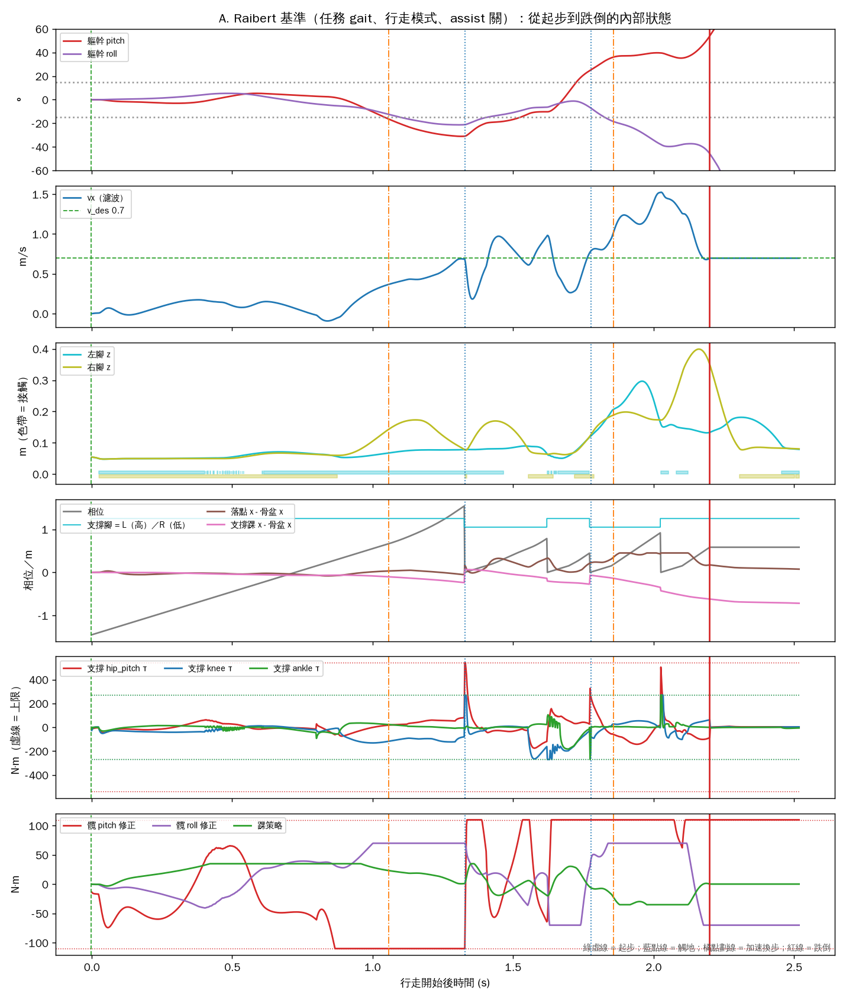
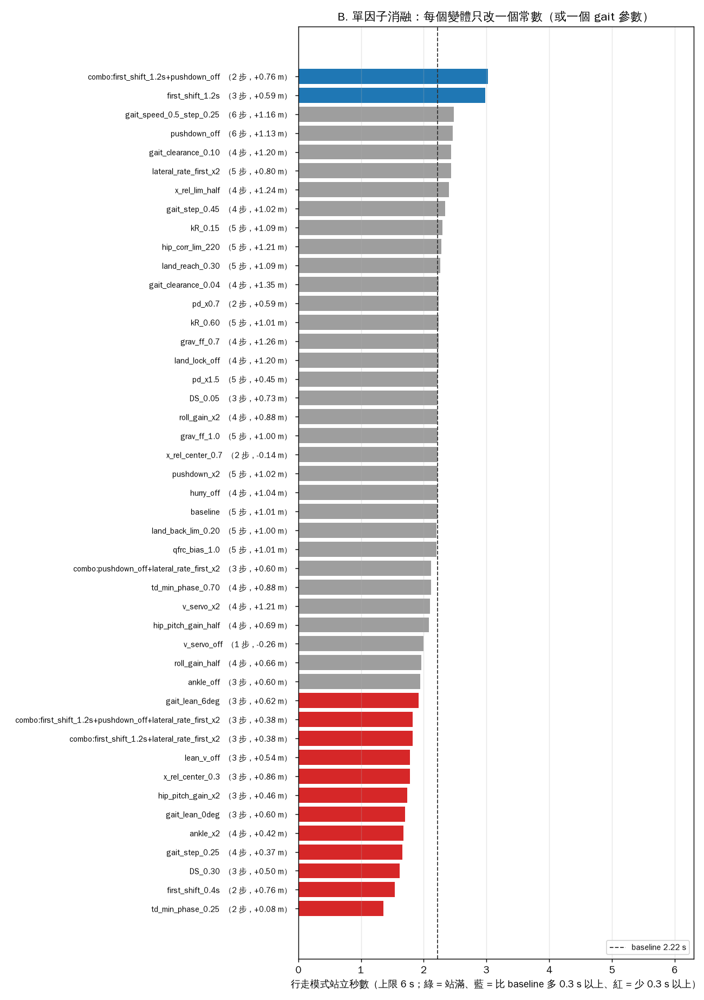

# Raibert 堆疊那個「起步後 2 秒必倒」的瓶頸：定位報告

日期：2026-09-22 ｜ 任務 #103 ｜ 性質：**DEVELOPMENT 診斷，量測記錄**；不是 protocol、不是 evidence、
不改任何控制器的預設行為 ｜ 上游：[CONTROLLER_COMPARISON_2026-09-22 §4.2、§6](CONTROLLER_COMPARISON_2026-09-22.md)
｜ harness：[`backend/diagnose_raibert_stack.py`](../backend/diagnose_raibert_stack.py)
｜ 圖與數據：[`docs/assets/raibert-diagnosis-2026-09-22/`](assets/raibert-diagnosis-2026-09-22/)

---

## 0. 一句話

**機制找到了，但它不是一個常數。** 41 個單因子變體加 4 個組合，沒有一個站過 3.02 s（baseline 2.22 s）。
跌倒在**第一步**就註定：用髖把骨盆推到支撐腳前方 → 軀幹後仰 31°、髖修正飽和 → 擺動腳懸在離地 3 cm、
觸地晚 275 ms → 落點被鎖在世界座標、落到骨盆**後方**而不是前方 → 接不住前衝動量 → 加速換步、早觸地、
前傾 39°、2.2 s 倒下。三段連鎖，每個常數只碰其中一段，所以調參救不了；要改的是結構（§6）。

---

## 1. 為什麼做

[CONTROLLER_COMPARISON_2026-09-22](CONTROLLER_COMPARISON_2026-09-22.md) 量到兩個訊號：`raibert` 與 `cp`
只差落腳與踝法則，卻在同一時點離開 LIPM 參考帶並倒下（§4.2）；三個 deterministic 控制器在
0.3–0.9 m/s 的站立秒數全落在 1.8–2.5 s、不隨速度變（§6）。當時的結論是「共用堆疊裡有一個和步數綁定的
瓶頸——假說，未定位」。這份報告去定位它。

---

## 2. 方法

### 2.1 前置：把常數搬出來，行為逐位元不變

`RaibertController.compute()` 裡 26 個字面值（加速換步門檻、觸地相位下限、起步橫移時間、落點限制、
速度伺服、側向限速、軀幹前傾項、末段下探、重力前饋比例、髖／踝修正增益與上限）搬成 class attribute，
數值不變。驗證：以 `run_motion_task.run_one("raibert")` 重跑凍結任務，**19 個 trace 陣列與搬移前逐位元相同**
（`cop_xy` 含 674 個 NaN，比對時 NaN 視為相等；其餘 18 個陣列不含 NaN）。
這讓消融可以用「子類別覆寫屬性」做，`controller_raibert.py` 的預設值就是原本的行為。

### 2.2 A. 儀器化基準

任務同一組 gait（0.7 m/s、步長 0.35 m、clearance 0.07 m）、行走模式、`assist_balance` 與 `startup_assist_enabled`
全關。一個不改行為的子類別在每個 physics tick（500 Hz）記一列：相位、支撐腳、左右接觸、骨盆位置與濾波速度、
pitch／roll、髖 pitch／roll 修正與踝策略輸出、落點與支撐踝相對骨盆的 x、左右腳掌高度、支撐腿髖／膝／踝的
扭矩與上限。跌倒後再跑 0.3 s 停止。

### 2.3 B. 單因子消融（清單在看到 A 之前寫死）

41 個變體，每個只改**一個**常數（或一個 gait 參數），其餘不動；各跑 6 s 行走模式，量站立秒數、步數、
前進距離、最大 |pitch|、膝飽和 tick 數。站滿 6 s 的變體再跑凍結任務——結果沒有一個站滿，所以這一步沒有執行。

### 2.4 B2. 前三名的組合（事後加的規則，據實揭露）

看到單因子結果**之後**才定的規則：取控制器常數變體中站立秒數最高的三個（排除 gait 變體），兩兩與三者一起組合。
4 個組合。這一段的規則不是事前寫死的，解讀時要打折。

模擬是 deterministic 的；同一份程式重跑數字逐位相同。行走從 t = 0 開始（沒有任務裡那 1 s 站立），
所以 baseline 在行走開始後 2.22 s 倒，比任務裡的 2.28 s（3.282 − 1.0）略早——初始狀態路徑不同，機制相同。

---

## 3. 基準時間線：從起步到跌倒發生了什麼



決策日誌（`td` 有 0.4 s 節流，第 3 步的觸地被節流掉）：

| 行走後 s | 事件 | 內容 |
|---:|---|---|
| 0.00 | `first` | 起步：重心先橫移至 L 腳，再跨出第一步 |
| 0.04 | `hip` | 髖策略介入 −43 N·m（軀幹 −0.1°） |
| 1.04 | `hip` | 髖策略介入 **−110 N·m（飽和）**，軀幹 −14.0° |
| 1.06 | `hurry` | 加速換步：capture point 超前支撐腳 20 cm |
| 1.33 | `td` | 第 2 步觸地（R 腳），**時序誤差 +275 ms** |
| 1.78 | `td` | 第 4 步觸地（R 腳），**時序誤差 −272 ms** |
| 1.86 | `hurry` | 加速換步：capture point 超前支撐腳 **42 cm** |
| 2.04 | `hip` | 髖策略介入 **+110 N·m（飽和）**，軀幹 +39.2° |
| 2.20 | `fall` | 跌倒：pitch 55°／roll −46° |

三個階段（對照圖的六個面板；綠虛線 = 起步、藍點線 = 觸地、橘點劃線 = 加速換步、紅線 = 跌倒）：

**0–0.85 s 橫移。** 相位從 −1.45 走到 0.15（DS），雙腳著地，pitch ≈ 0，vx ≈ 0.1。正常。

**0.85–1.33 s 第一步——三件事同時發生。**
- 面板 1／6：右腳一離地，pitch 就從 0 一路掉到 **−31°**（後仰）；髖 pitch 修正在 0.9 s 就貼到 **−110 N·m 上限**，
  一直貼到觸地。
- 面板 2／4：vx 從 0 拉到 0.7；「支撐踝 x − 骨盆 x」（粉）從 0 掉到 **−0.25 m**——骨盆被推到支撐腳前方 25 cm。
- 面板 3／4：右腳 z 在 1.05 s 之後**停在 0.075–0.08 m**（站立時腳掌高 0.05 m，即離地約 3 cm）不再下降；
  「落點 x − 骨盆 x」（棕）從 +0.03 m 變成 **−0.05 m**——落點在相位 0.85 鎖定於世界座標後，骨盆繼續前進，
  落點就跑到骨盆後面。觸地在相位 1.55 才發生，**晚 275 ms**。

**1.33–2.20 s 收不回來。** 觸地瞬間支撐髖與膝的扭矩尖峰到上限（面板 5）；vx 在 0.2–1.0 之間振盪；
第 3、4 步各只有約 0.22 s（早 272 ms）；capture point 超前 42 cm 觸發加速換步；pitch 從 −20° 翻到 +39°，
髖修正反向飽和 +110 N·m；2.20 s 倒下。

---

## 4. 消融：沒有任何一個常數能救它

45 列（41 個單因子 + 4 個組合），依站立秒數排序：

| 變體 | 改了什麼 | 站立 s | 步數 | 距離 m | max \|pitch\| ° | 對 baseline |
|---|---|---:|---:|---:|---:|---|
| `combo:first_shift_1.2s+pushdown_off` | 組合：first_shift_1.2s + pushdown_off | 3.02 | 2 | +0.76 | 57.5 | +0.80 |
| `first_shift_1.2s` | `FIRST_SHIFT_S`=1.2 | 2.98 | 3 | +0.59 | 38.3 | +0.76 |
| `gait_speed_0.5_step_0.25` | gait `speed`=0.5, gait `step_length`=0.25 | 2.48 | 6 | +1.16 | 50.8 | +0.26 |
| `pushdown_off` | `PUSHDOWN_RATE`=0.0 | 2.46 | 6 | +1.13 | 57.9 | +0.24 |
| `lateral_rate_first_x2` | `LATERAL_RATE_FIRST`=0.3 | 2.44 | 5 | +0.80 | 44.1 | +0.22 |
| `gait_clearance_0.10` | gait `clearance`=0.1 | 2.44 | 4 | +1.20 | 57.5 | +0.22 |
| `x_rel_lim_half` | `X_REL_LIM_M`=0.16 | 2.40 | 4 | +1.24 | 56.1 | +0.18 |
| `gait_step_0.45` | gait `step_length`=0.45 | 2.34 | 4 | +1.02 | 54.8 | +0.12 |
| `kR_0.15` | `kR`=0.15 | 2.30 | 5 | +1.09 | 56.6 | +0.08 |
| `hip_corr_lim_220` | `HIP_CORR_LIM_NM`=220.0 | 2.28 | 5 | +1.21 | 56.5 | +0.06 |
| `land_reach_0.30` | `LAND_REACH_M`=0.3 | 2.26 | 5 | +1.09 | 56.1 | +0.04 |
| `land_lock_off` | `LAND_LOCK_PHASE`=1.1 | 2.24 | 4 | +1.20 | 30.6 | +0.02 |
| `grav_ff_0.7` | `GRAV_FF_SCALE`=0.7 | 2.24 | 4 | +1.26 | 55.7 | +0.02 |
| `kR_0.60` | `kR`=0.6 | 2.24 | 5 | +1.01 | 55.2 | +0.02 |
| `pd_x0.7` | `_pd_scale`=0.7 | 2.24 | 2 | +0.59 | 33.1 | +0.02 |
| `gait_clearance_0.04` | gait `clearance`=0.04 | 2.24 | 4 | +1.35 | 61.1 | +0.02 |
| `baseline` | — | 2.22 | 5 | +1.01 | 61.3 | **baseline** |
| `hurry_off` | `HURRY_CP_AHEAD_M`=9.9 | 2.22 | 4 | +1.04 | 56.7 | ±0 |
| `pushdown_x2` | `PUSHDOWN_RATE`=0.7 | 2.22 | 5 | +1.02 | 60.6 | ±0 |
| `x_rel_center_0.7` | `X_REL_PHASE_CENTER`=0.7 | 2.22 | 2 | -0.14 | 55.4 | ±0 |
| `grav_ff_1.0` | `GRAV_FF_SCALE`=1.0 | 2.22 | 5 | +1.00 | 57.8 | ±0 |
| `roll_gain_x2` | `ROLL_KP`=440.0, `ROLL_KD`=110.0 | 2.22 | 4 | +0.88 | 57.4 | ±0 |
| `DS_0.05` | `DS`=0.05 | 2.22 | 3 | +0.73 | 56.1 | ±0 |
| `pd_x1.5` | `_pd_scale`=1.5 | 2.22 | 5 | +0.45 | 38.7 | ±0 |
| `qfrc_bias_1.0` | `QFRC_BIAS_SCALE`=1.0 | 2.20 | 5 | +1.01 | 58.1 | -0.02 |
| `land_back_lim_0.20` | `LAND_BACK_LIM_M`=0.2 | 2.20 | 5 | +1.00 | 52.1 | -0.02 |
| `td_min_phase_0.70` | `TD_MIN_PHASE`=0.7 | 2.12 | 4 | +0.88 | 57.1 | -0.10 |
| `combo:pushdown_off+lateral_rate_first_x2` | 組合：pushdown_off + lateral_rate_first_x2 | 2.12 | 3 | +0.60 | 25.5 | -0.10 |
| `v_servo_x2` | `V_SERVO_GAIN`=0.5 | 2.10 | 4 | +1.21 | 57.1 | -0.12 |
| `hip_pitch_gain_half` | `HIP_PITCH_KP`=130.0, `HIP_PITCH_KD`=60.0 | 2.08 | 4 | +0.69 | 55.2 | -0.14 |
| `v_servo_off` | `V_SERVO_GAIN`=0.0 | 2.00 | 1 | -0.26 | 56.2 | -0.22 |
| `roll_gain_half` | `ROLL_KP`=110.0, `ROLL_KD`=27.5 | 1.96 | 4 | +0.66 | 54.8 | -0.26 |
| `ankle_off` | `ANKLE_KV`=0.0 | 1.94 | 3 | +0.60 | 55.3 | -0.28 |
| `gait_lean_6deg` | gait `torso_lean_deg`=6.0 | 1.92 | 3 | +0.62 | 58.4 | -0.30 |
| `combo:first_shift_1.2s+lateral_rate_first_x2` | 組合：first_shift_1.2s + lateral_rate_first_x2 | 1.82 | 3 | +0.38 | 55.2 | -0.40 |
| `combo:first_shift_1.2s+pushdown_off+lateral_rate_first_x2` | 組合：first_shift_1.2s + pushdown_off + lateral_rate_first_x2 | 1.82 | 3 | +0.38 | 55.2 | -0.40 |
| `x_rel_center_0.3` | `X_REL_PHASE_CENTER`=0.3 | 1.78 | 3 | +0.86 | 56.6 | -0.44 |
| `lean_v_off` | `LEAN_V_GAIN`=0.0 | 1.78 | 3 | +0.54 | 49.1 | -0.44 |
| `hip_pitch_gain_x2` | `HIP_PITCH_KP`=520.0, `HIP_PITCH_KD`=240.0 | 1.74 | 3 | +0.46 | 57.5 | -0.48 |
| `gait_lean_0deg` | gait `torso_lean_deg`=0.0 | 1.70 | 3 | +0.60 | 58.5 | -0.52 |
| `ankle_x2` | `ANKLE_KV`=140.0, `ANKLE_LIM_NM`=70.0 | 1.68 | 4 | +0.42 | 35.0 | -0.54 |
| `gait_step_0.25` | gait `step_length`=0.25 | 1.66 | 4 | +0.37 | 58.5 | -0.56 |
| `DS_0.30` | `DS`=0.3 | 1.62 | 3 | +0.50 | 56.2 | -0.60 |
| `first_shift_0.4s` | `FIRST_SHIFT_S`=0.4 | 1.54 | 2 | +0.76 | 36.8 | -0.68 |
| `td_min_phase_0.25` | `TD_MIN_PHASE`=0.25 | 1.36 | 2 | +0.08 | 41.9 | -0.86 |



- **沒有任何變體站滿 6 s。** 最好的單因子是 `first_shift_1.2s`（起步橫移 0.8 → 1.2 s）：2.98 s，
  比 baseline 多 0.76 s——但它只是把第一步往後延 0.4 s，跌倒也差不多往後延 0.4 s，步數還從 5 變 3。
- **組合不可加。** `first_shift_1.2s + pushdown_off` 3.02 s（≈ 兩者較大值）；再加 `lateral_rate_first_x2` 反而掉到 1.82 s。
- **方向性訊號一致**：把第一步做得更急的（`first_shift_0.4s`、`td_min_phase_0.25`、`DS_0.30`、`gait_step_0.25`、
  `gait_lean_0deg`）全部更早倒；做得更慢的（`first_shift_1.2s`、`gait_speed_0.5`）延後。跌倒和**第一步建立動量的方式**綁在一起。
- 幾個「應該有用」的旋鈕沒用：`hip_corr_lim_220`（把髖修正上限翻倍）只多 0.06 s，因為關節扭矩上限本身也在夾；
  `land_lock_off` 把最大 pitch 從 61° 壓到 31°，但仍在 2.24 s 倒——它解了連鎖的第三段，前兩段照樣把它送到同一個終點；
  `hurry_off`、`pushdown_x2`、`grav_ff`、`qfrc_bias`、`kR`、`land_back_lim`、`land_reach` 對跌倒時間幾乎沒有影響（±0.1 s 內）。

---

## 5. 機制：三段連鎖（[INFERENCE]，由 §3 的量測推出）

1. **前推的來源是髖，反作用落在軀幹。** 起步時支撐腿的骨盆伺服目標 `x_rel = (φ − 0.5)·v_des·T + v_servo` 從 −0.12 m
   走到 +0.175 m，再加速度伺服 +0.12 m：骨盆要在一步內從支撐腳後方推到前方 0.25 m。這股推力經支撐髖施加，
   對軀幹的反作用是後仰；負責把軀幹拉回的髖姿態修正上限只有 110 N·m，0.9 s 就飽和，pitch 掉到 −31°。
   （面板 1、4、6；`hip_corr_lim_220` 沒用，因為 `tau_lim` 也會夾。）
2. **軀幹一後仰，擺動腳就懸空。** IK 以「骨盆水平」解幾何，再把量到的 pitch 從髖參考扣掉（`dp` 上限 0.5 rad）；
   pitch −31° 時這個補償接近上限，擺動腳的實際高度停在離地 3 cm，末段下探（0.35 m／相位）壓不到地面，
   觸地晚了 275 ms。（面板 3；事件表。`pushdown_off`／`pushdown_x2` 都沒用——問題不在下探速率。）
3. **落點鎖在世界座標，晚觸地就落到後面。** 相位 0.85 鎖定當時的落點是為了「擺動腳追不上一直改的目標」，
   但晚了 275 ms 的觸地期間骨盆又前進約 0.2 m，落點從骨盆前 3 cm 變成骨盆後 5 cm。第二步落在質心下方而非前方，
   接不住 0.7 m/s 的前衝；之後 capture point 超前 42 cm、加速換步、早觸地、前傾飽和、倒下。
   （面板 4 的棕線；`land_lock_off` 把 max pitch 壓一半但沒改跌倒時間，因為 1、2 段照舊。）

**為什麼 `cp` 也在同一時點倒**：它只換了落點公式與踝策略，1、2 段一字未動；第 3 段的鎖定邏輯也是共用的。
這解釋了 CONTROLLER_COMPARISON §4.2 的觀察。

**為什麼跌倒時間對速度不敏感**：連鎖從第一步的髖飽和開始，而飽和發生在建立動量的過程本身，速度只改變終點的細節。

---

## 6. 這意味著什麼：接下來是結構，不是參數

四個候選，**每一個都是新的控制器版本**，需另立名稱、在 compare 與凍結任務上重新量測並揭露；
本報告沒有實作任何一個，`raibert` 預設行為未動。

| 候選 | 對付哪一段 | 內容 |
|---|---|---|
| a. 起步策略 | 1 | 先把質心／capture point 移到支撐腳**正上方**（x 與 y 都做）再抬腳。現在的橫移只做 y，x 靠第一步的髖推力硬拉 |
| b. 前推改由踝產生 | 1 | 支撐踝力矩負責前向加速（現在踝策略只做 ±35 N·m 的速度阻尼），髖只管姿態，反作用不再落在軀幹 |
| c. 落點改相對座標或持續更新 | 3 | 鎖定改為相對骨盆，或觸地前持續以 capture point 更新落點；「追不上」的問題要和 d 一起解 |
| d. 擺動腳觸地伺服 | 2 | 以高度／接觸力伺服把腳送到地面（swing-leg retraction），不靠固定速率下探 |

順序上 a 或 b 先：它們斷的是連鎖的第一段。這是 [ROADMAP §2](ROADMAP.md) M6「deterministic nominal comparison」
產品面的工作；[PROJECT_ASSESSMENT §3](PROJECT_ASSESSMENT_2026-09-16.md) 的問題仍然成立——沒有任何學術 gate 在等它，
它的價值在教學展示（三機比較現在三個倒兩個）。

---

## 7. 不能拿這份報告說什麼

| 不能說 | 為什麼 |
|---|---|
| 「Raibert 法則不行」 | 這是這個堆疊裡的**起步實作**出了問題，不是 Raibert 落腳法則；落腳法則換成 CP 結果相同正說明瓶頸不在那裡 |
| 「改 a／b／c／d 就會走」 | 全是 [INFERENCE]；沒有實作、沒有量測 |
| B2 的組合結果 | 規則事後才定，只當方向參考 |
| 任何實體能力 | 全部是 `SOFTWARE_ONLY_MUJOCO_REALIZED_SIMULATION`，一個 plant、deterministic、n = 1 |

---

## 8. 重現

```bash
python -X utf8 backend/diagnose_raibert_stack.py            # A + B + B2，約 25 s
python -X utf8 backend/diagnose_raibert_stack.py --skip-task
```

輸出：`fig1_baseline_timeline.png`、`fig2_ablation.png`、`baseline_timeline.csv`（100 Hz 降頻）、
`summary.json`（所有變體的數值、事件、程式 sha256）。

| 檔 | 變更 |
|---|---|
| `backend/controller_raibert.py` | 26 個常數搬成 class attribute，行為逐位元不變（§2.1） |
| `backend/diagnose_raibert_stack.py` | **新增**：儀器化子類別、變體工廠、消融、圖 |
| `docs/assets/raibert-diagnosis-2026-09-22/` | 2 張圖、CSV、`summary.json` |
