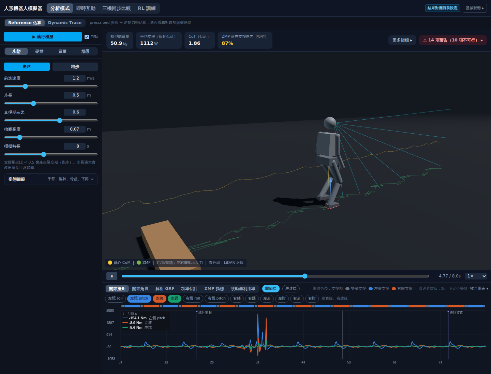
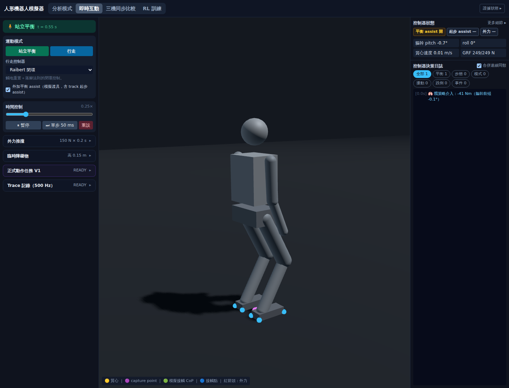
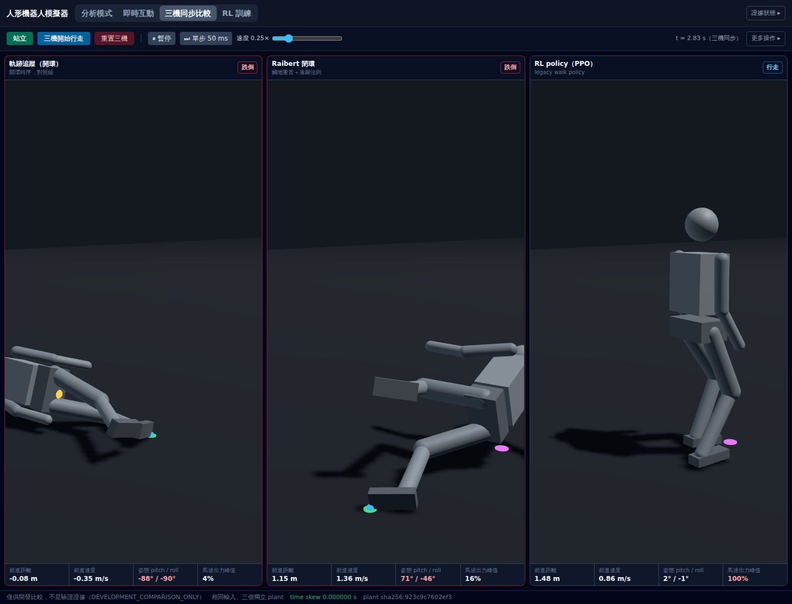
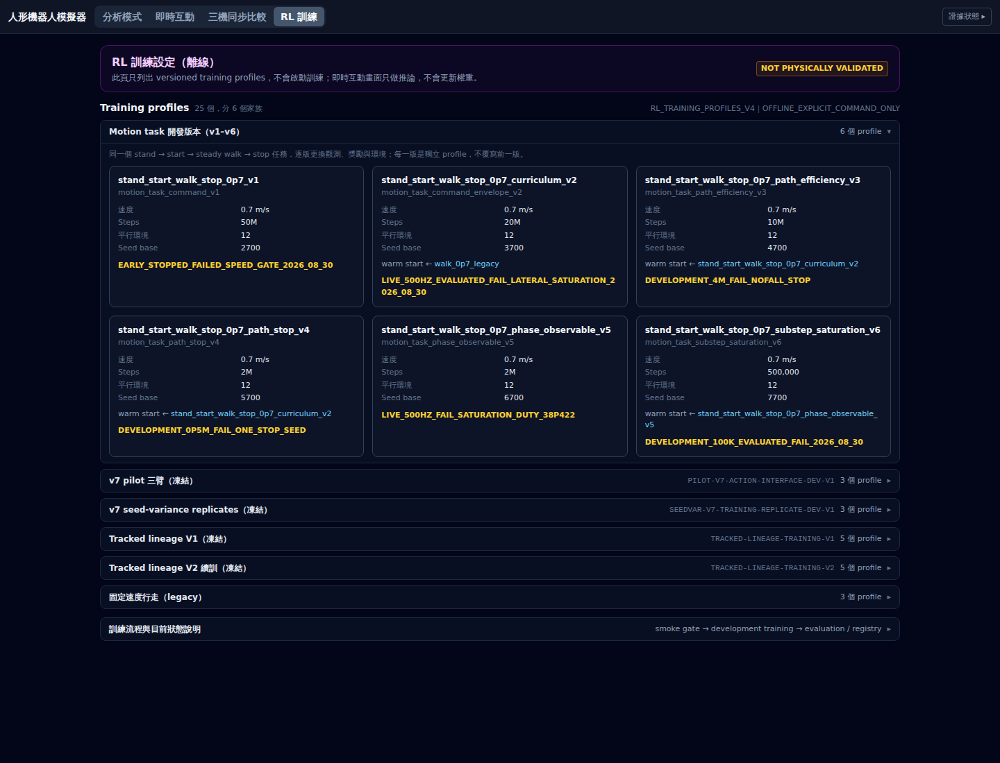
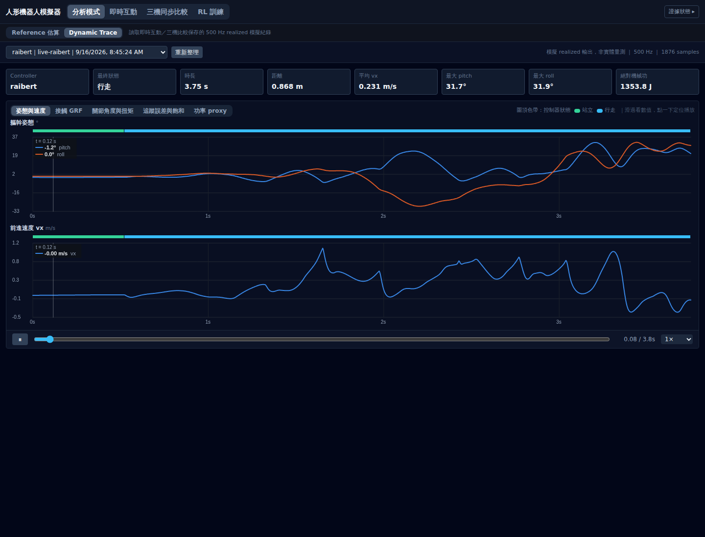

# 全面測試報告

日期：2026-09-20 ｜ 任務 #100 ｜ 性質：**量測記錄**；不是 protocol、不是新的契約
｜ 受測版本：`claude/project-progress-ukgoea` @ `492f452`（PR #47 的 head）

---

## 0. 一句話

**1,062 個測試收集、1,061 通過、1 個失敗——那 1 個是既有且未放寬的失敗；五個前端畫面全部實際渲染並截圖存證。**

---

## 1. 後端測試套件

```
python3 -X utf8 -m pytest backend/ -p no:cacheprovider -q
```

| 項目 | 量測值 |
|---|---|
| 收集到的測試 | **1,062** |
| 通過 | **1,061** |
| 失敗 | **1** |
| 跳過 | **0** |
| 耗時 | **499.18 s**（8 分 19 秒） |
| exit code | `1` |

> 本次耗時比先前的 ~355 s 長，因為量測期間同一台機器同時跑著 API 與前端 dev server（見 §3）。

### 1.1 那個唯一的失敗

```
FAILED backend/test_v1_analytical_suite.py::test_stdlib_replay_passes_exact_synthetic_fixture
E   AssertionError: assert 'FAIL' == 'PASS'
        assert replay["status"] == "PASS"
```

stdlib-only replay 對合成 fixture 回傳 `FAIL` 而非 `PASS`。

**這是既有失敗，不是本次引入的。** `STATUS.yaml` 對它的既有歸因是
「`PRIMARY_CASE_RECEIPT_IDENTITY` reduction-order difference, **NOT relaxed**」。

**誠實聲明：本次沒有重新推導它的根因**，只確認同一個測試、同一個斷言、同一個結果重現。
它在 2026-09-16 起的每一次量測都是這一個，測試**沒有被放寬或跳過**。

### 1.2 測試數量分佈（前 14 個檔案）

| 檔案 | 測試數 |
|---|---:|
| `archive/test_training_seed_variance_contract.py` | 113 |
| `test_run_manifest_lock.py` | 82 |
| `archive/test_tracked_lineage_contract.py` | 74 |
| `test_v7_exposure_audit_contract.py` | 72 |
| `test_v7_action_interface.py` | 70 |
| `test_environment_lock.py` | 66 |
| `test_p0_contract.py` | 50 |
| `archive/test_tracked_lineage_v2_contract.py` | 50 |
| `archive/test_second_case_exposure_contract.py` | 49 |
| `archive/test_v7_candidate_selection_contract.py` | 47 |
| `test_module_boundary_contract.py` | 37 |
| `archive/test_v7_pilot_contract.py` | 29 |
| `test_experiment_matrix_contract.py` | 28 |
| `test_paired_statistics_contract.py` | 27 |

`backend/archive/` 底下的 **376 個測試仍然全部在跑**——封存的是位置，不是檢查。

---

## 2. 契約與一致性檢查

三個 fail-closed 文件契約，全部以 `python3 -I -S`（隔離、無 site）執行：

| 契約 | 結果 |
|---|---|
| `gate_status_contract` | `GATE_STATUS_SINGLE_SOURCE_CONSISTENT: 33 gates, 54 sites` |
| `derived_claim_contract` | `DERIVED_CLAIMS_CONSISTENT: 1 claim, 3 sites, 10 papers tracked` |
| `module_boundary_contract` | `MODULE_BOUNDARIES_CLEAN: teaching 15 模組／4,943 行；toolkit 7 模組／5,508 行` |

**連結檢查：掃描 796 個 Markdown 內部連結，壞掉 0 個。**

**文件分佈：** `docs/` 51 份、`docs/archive/` 18 份、`docs/receipts/` 15 份（含各自的索引 README）。

---

## 3. 前端

| 檢查 | 指令 | 結果 |
|---|---|---|
| TypeScript 型別 | `npm run typecheck` | **exit 0**，無錯誤 |
| production build | `npm run build` | **exit 0**，`✓ built in 7.48s` |

build 有一個非阻斷警告：有 chunk 超過 500 kB（three.js）。**未處理**，不在本次範圍。

### 3.1 README 承諾的啟動指令：實測成立

README「快速啟動」最後一行是 `python -X utf8 backend/main.py`（production 路徑，
由後端直接供應已 build 的前端）。**實測驗證通過**：

| 端點 | 回應 |
|---|---|
| `GET http://127.0.0.1:8710/` | **200** |
| `GET http://127.0.0.1:8710/api/defaults` | **200** |

日誌：`INFO: Uvicorn running on http://127.0.0.1:8710`。**README 的指令是準確的。**

> 附帶量到的一件事：`uvicorn backend.main:app`（從 repo 根目錄、以套件路徑指定）**會失敗**，
> 丟 `ModuleNotFoundError: No module named 'config_schema'`——後端模組用平坦 import，
> 必須讓 `backend/` 成為 `sys.path[0]`。README 寫的 `python backend/main.py` 正好滿足這點；
> 截圖用的 dev 路徑則是 `cd backend && python3 -m uvicorn main:app`。

### 3.2 截圖用的 dev 環境

FastAPI 後端 `127.0.0.1:8710`（須從 `backend/` 起，模組用平坦 import），
Vite dev server `127.0.0.1:5183`，`/api` 由 Vite proxy 轉發。兩者皆回 `200`。

---

## 4. 五個畫面的實際渲染

以 Chromium（1440×1100）載入、點擊分頁、等待渲染後以 CDP `Page.captureScreenshot` 取幀。

> **為什麼用 CDP 而不是 Playwright 的 `screenshot()`**：3D 畫面是持續重繪的 three.js canvas，
> Playwright 會等待「畫面穩定」而逾時。CDP 直接取當前幀，不等穩定。

### 4.1 分析模式（Reference 估算）



實測顯示：模型總質量 50.9 kg、平均功率 1112 W、CoT 1.86、ZMP 落在支撐區內 87%；
3D 場景含 CoM／ZMP／地面反力／LiDAR 射線；下方關節扭矩圖帶支撐相色帶。
右上角 **「14 項警告（10 項不可行）」** ——參數不可行時會明說，不會假裝可行。

### 4.2 即時互動



站立平衡 t = 0.55 s，軀幹 pitch −0.7°、roll 0°，質心速度 0.01 m/s，GRF 249/249 N。
右側「控制器決策日誌」記錄了 1 筆策略介入（−41 Nm，軀幹前傾 −0.1°）並可依類別篩選。
左側 `正式動作任務 V1` 與 `Trace 記錄（500 Hz）` 皆為 `READY`。

### 4.3 三機同步比較



**這張是實際跑起來的狀態**（t = 2.83 s），不是靜止畫面：

| 控制器 | 狀態 | 前進距離 | 前進速度 | pitch/roll | 馬達出力峰值 |
|---|---|---|---|---|---|
| 軌跡追蹤（開環） | **跌倒** | −0.08 m | −0.35 m/s | −88°／−90° | 4% |
| Raibert 閉環 | **跌倒** | 1.15 m | 1.36 m/s | 71°／−46° | 16% |
| RL policy（PPO） | **行走** | 1.48 m | 0.86 m/s | 2°／−1° | 100% |

底部標示 `time skew 0.000000 s` 與共同的 `plant sha256:923c9c7602ef3`——三個控制器跑在
**同一個 plant、零時間偏移**下。整條 bar 標著 `DEVELOPMENT_COMPARISON_ONLY`：
**這是開發比較，不是驗證證據。**

### 4.4 RL 訓練



25 個 versioned training profile，分 6 個家族，依研究線分組（Motion task 開發版 v1–v6、
v7 pilot 三臂、v7 seed-variance replicates、Tracked lineage V1／V2、legacy）。
每張卡片標示速度、steps、平行環境、seed base、warm start 來源，以及**結果標籤**——
`EARLY_STOPPED_FAILED_SPEED_GATE`、`LIVE_500HZ_EVALUATED_FAIL_LATERAL_SATURATION`、
`DEVELOPMENT_4M_FAIL_NOFALL_STOP` 等，失敗一個都沒有藏。

頁首兩個標籤：**`NOT PHYSICALLY VALIDATED`** 與 **`OFFLINE_EXPLICIT_COMMAND_ONLY`**
（此頁不啟動訓練、不更新權重）。

### 4.5 Dynamic Trace



載入一筆真實的 500 Hz realized 紀錄（`raibert | live-raibert`，1876 samples）：
時長 3.75 s、距離 0.868 m、平均 vx 0.231 m/s、最大 pitch 31.7°、最大 roll 31.9°、
絕對機械功 1353.8 J。圖頂色帶標示控制器狀態（站立／行走）。
標頭明寫 **「模擬 realized 輸出，非實體量測」**。

### 4.6 主控台錯誤

五頁合計 **1 個主控台錯誤**，發生在分析模式：
`Failed to load resource: the server responded with a status of 404 (Not Found)`。
**未定位到是哪一個資源**（很可能是 favicon 一類的靜態資產）；
不影響任何畫面渲染，五頁皆完整顯示。**這一項留著，沒有修。**

---

## 5. 明確不在本次範圍

| 沒做 | 說明 |
|---|---|
| **沒有重新推導那個既有失敗的根因** | §1.1；只確認它重現且未被放寬 |
| **沒有追查那個 404** | §4.6；已記錄，未定位 |
| **沒有處理 build 的 chunk 大小警告** | §3 |
| **沒有跑任何 RL 訓練或評估** | 需要 GPU 時數與 lock 綁定，屬獨立研究線 |
| **沒有實體硬體量測** | 全部是模擬 realized 輸出，各頁自己也這樣標示 |
| **沒有跨瀏覽器測試** | 只在 Chromium 1440×1100 |

---

## 6. 重現方式

```bash
# 後端全套
python3 -X utf8 -m pytest backend/ -p no:cacheprovider -q

# 三個文件契約
python3 -I -S backend/gate_status_contract.py
python3 -I -S backend/derived_claim_contract.py
python3 -I -S backend/module_boundary_contract.py

# 前端
cd frontend && npm run typecheck && npm run build

# 起服務（截圖用）
cd backend && python3 -m uvicorn main:app --host 127.0.0.1 --port 8710
cd frontend && npx vite --port 5183 --host 127.0.0.1
```
