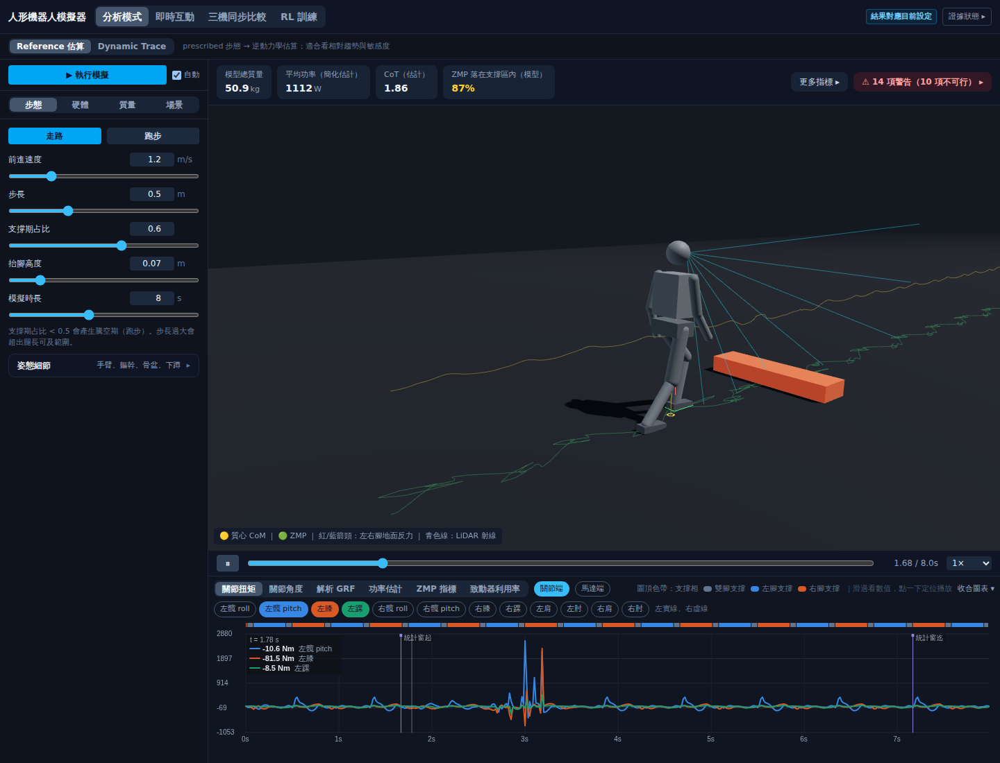
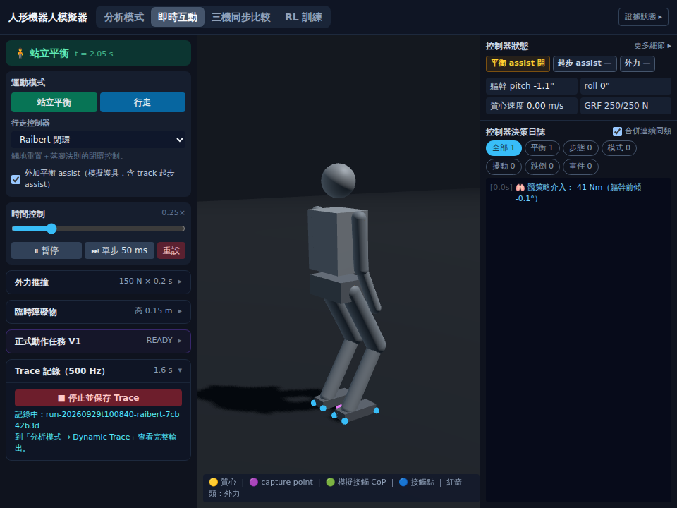
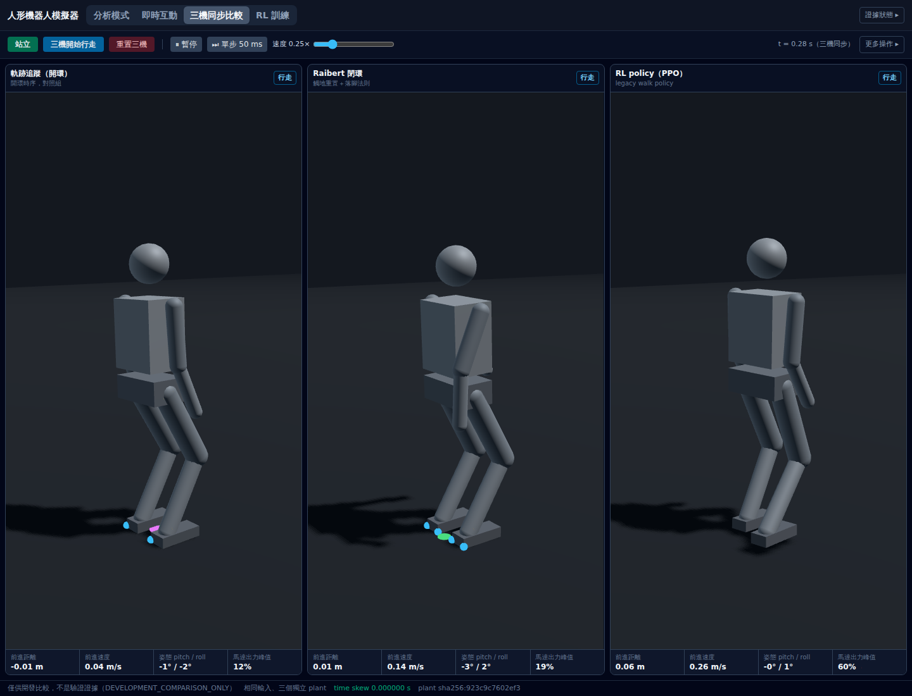
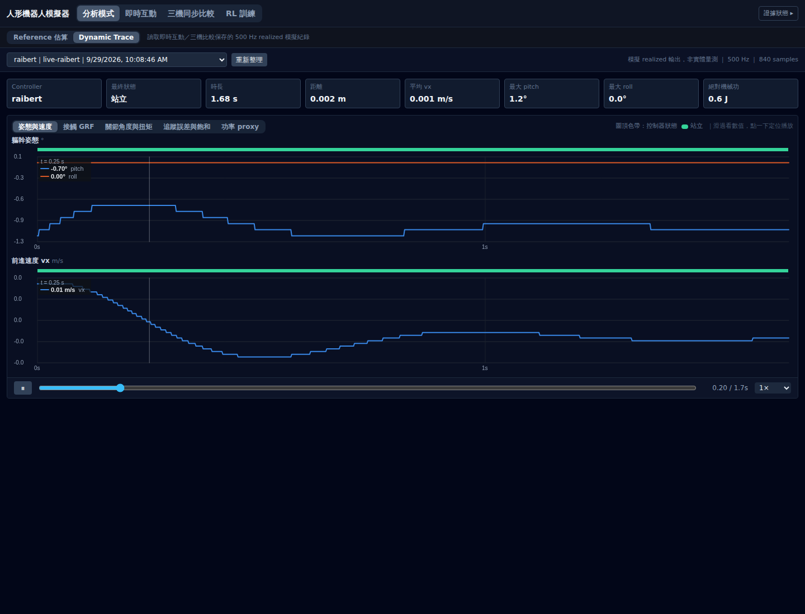
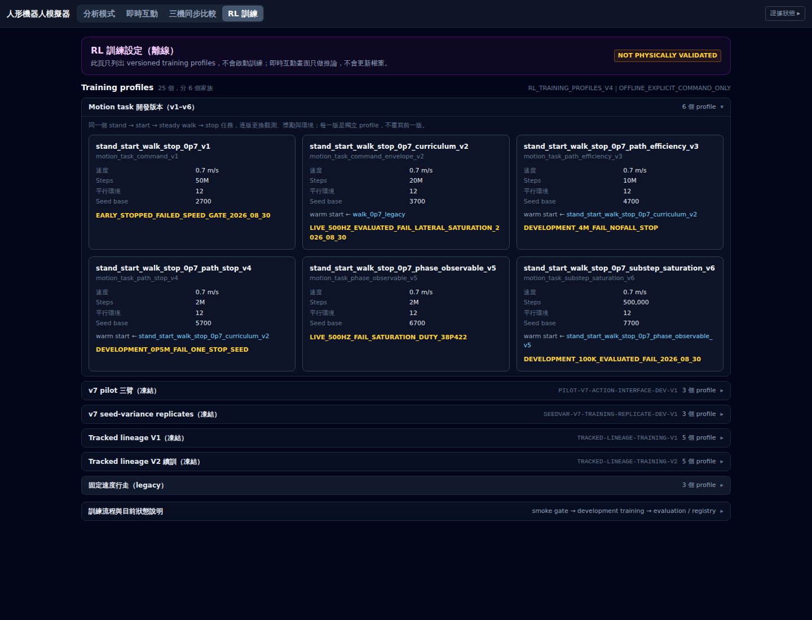

# 全面測試報告

日期：2026-09-29 ｜ 任務 #108 ｜ 性質：**量測記錄**；不是 protocol、不是新的契約
｜ 受測版本：`claude/project-progress-ukgoea` @ `423c4ef`（PR #50 的 head，含 2026-09-22 的三個 V1 suite）
｜ 機器：4 核容器、Chromium headless（SwiftShader 軟體 GL）、MuJoCo 3.12.0
｜ 前一份：[TEST_REPORT_2026-09-20](TEST_REPORT_2026-09-20.md)

---

## 0. 一句話

**後端 1,136 個測試收集、1,135 通過、1 個失敗——那 1 個是既有且未放寬的失敗；三個文件契約、98 份文件的連結、前端型別與 build 全部乾淨；六項瀏覽器測試最後 6/6 通過並重新截圖存證，但過程量到一件值得記下的事：這台機器的 headless 渲染追不上即時互動頁的 30 fps 串流，畫面落後網路兩秒以上、後端指令因 backpressure 延後處理——這是測試環境的渲染吞吐限制，也順帶指出即時頁沒有 backpressure 處理。**

---

## 1. 後端測試套件

```
python3 -X utf8 -m pytest backend/ -p no:cacheprovider -q --durations=15
```

| 項目 | 量測值 |
|---|---|
| 收集到的測試 | **1,136** |
| 通過 | **1,135** |
| 失敗 | **1** |
| 跳過 | **0** |
| 警告 | 6（全是第三方 fastapi／starlette 的棄用警告，無一來自專案碼） |
| 耗時 | **753.30 s**（12 分 33 秒） |
| exit code | `1` |

> 耗時比 2026-09-22 在同一 commit 內容上量到的 `517.19` s 長 46%：本次量測期間同一台 4 核機器同時在跑瀏覽器測試（含 `npm run build`、Chromium）與兩次 WebSocket 探針。**秒數照量到的記，不做正規化，也不當回歸指標**；當回歸指標的是通過數與失敗身分。

### 1.1 那個唯一的失敗

```
FAILED backend/test_v1_analytical_suite.py::test_stdlib_replay_passes_exact_synthetic_fixture
E   AssertionError: assert 'FAIL' == 'PASS'
```

**既有失敗，不是本次引入的。** `STATUS.yaml` 對它的既有歸因是「`PRIMARY_CASE_RECEIPT_IDENTITY` reduction-order difference，**NOT relaxed**」；自 2026-09-16 起每次量測都是這一個，測試**沒有被放寬或跳過**。本次同樣沒有重新推導根因，只確認同一個測試、同一個斷言、同一個結果重現。

### 1.2 最慢的測試

| 測試 | 秒 |
|---|---:|
| `test_v1_actuated_energy_suite.py::test_primary_suite_passes_the_frozen_contract`（setup：跑 6 個凍結 case） | 34.02 |
| `archive/test_second_case_runner.py::test_tiny_end_to_end_cell_produces_contract_valid_rows` | 21.66 |
| `test_environment_lock.py::test_cli_capture_and_match_exit_zero` | 12.71 |
| `test_paper_data_contract.py::test_v1_oracle_builds_integrity_validated_regression_bundle` | 12.50 |
| `test_v1_actuated_energy_suite.py::test_summary_without_raw_drops_traces_but_keeps_criteria` | 10.66 |
| `test_v1_actuated_energy_suite.py::test_replay_retains_torque_tamper_as_fail` | 10.40 |

2026-09-22 新增的三個 V1 suite 是現在最重的測試檔：致動能量 suite 的 primary 是 139 MB 的序列化 trace，replay 與篡改測試各要走一遍。

### 1.3 測試數量分佈

| 檔案 | 測試數 |
|---|---:|
| `archive/test_training_seed_variance_contract.py` | 113 |
| `test_run_manifest_lock.py` | 82 |
| `archive/test_tracked_lineage_contract.py` | 74 |
| `test_v7_exposure_audit_contract.py` | 72 |
| `test_v7_action_interface.py` | 70 |
| `test_environment_lock.py` | 66 |
| `test_p0_contract.py` | 50 |
| `archive/test_tracked_lineage_v2_contract.py` | 50 |
| `archive/test_second_case_exposure_contract.py` | 49 |
| `archive/test_v7_candidate_selection_contract.py` | 47 |
| `test_module_boundary_contract.py` | 37 |
| `archive/test_v7_pilot_contract.py` | 29 |
| `test_experiment_matrix_contract.py` | 28 |
| `test_paired_statistics_contract.py` | 27 |
| `test_gate_status_contract.py` | 27 |
| `test_derived_claim_contract.py` | 26 |

- `backend/archive/` 底下的 **379 個測試仍然全部在跑**——封存的是位置，不是檢查。
- V1 plant 可信度 oracle 共 **127 個**測試：`test_v1_oracles` 18、`test_v1_analytical_suite` 20、`test_v1_analytical_bundle` 12、`test_paper_data_contract` 12、`test_v1_dynamic_reference_suite` 20、`test_v1_contact_reference_suite` 22、`test_v1_actuated_energy_suite` 22（後三檔為 2026-09-22 新增）。
- 對帳：2026-09-22 的 `1,136`（`b4b5900`）→ 本次 `1,136`，**＋0**：`423c4ef` 之後沒有新增後端測試；本次的兩個變更檔在 `frontend/e2e/`，刻意不在 `pytest backend/` 集合裡。

---

## 2. 契約與一致性檢查

| 契約 | 結果 |
|---|---|
| `gate_status_contract` | `GATE_STATUS_SINGLE_SOURCE_CONSISTENT: 33 gates, 54 sites` |
| `derived_claim_contract` | `DERIVED_CLAIMS_CONSISTENT: 1 claim, 3 sites, 10 papers tracked` |
| `module_boundary_contract` | `MODULE_BOUNDARIES_CLEAN: teaching 16 模組／5,104 行；toolkit 7 模組／5,508 行` |

**連結檢查：掃描 98 份 tracked Markdown 的相對連結，壞掉 0 個。**
**文件分佈：** `docs/` 58 份、`docs/archive/` 18 份、`docs/receipts/` 19 份（含各自的索引 README）。

---

## 3. 前端

| 檢查 | 指令 | 結果 |
|---|---|---|
| TypeScript 型別 | `npm run typecheck` | **exit 0**，無錯誤 |
| production build | `npm run build` | **exit 0**，`✓ built in 2.68s`；chunk > 500 kB 的非阻斷警告仍在（three.js），**未處理** |

---

## 4. 六項瀏覽器測試（production 路徑）

```
python3 -X utf8 -m pytest frontend/e2e -p no:cacheprovider -q
```

流程與 2026-09-22 的 [receipt](receipts/BROWSER_VISUAL_VERIFICATION_RECEIPT_2026-09-22.md) 相同：`npm run build` → 以 uvicorn 起 `backend/main.py` 的 app（直接供應 dist）→ Chromium headless 實際操作五個畫面、讀回數字對 API、CDP 取幀、斷言 console 與 page error 為零。

### 4.1 三次執行，先 FAIL 後 PASS，照實記

| 次 | 條件 | 結果 |
|---|---|---|
| 1 | 後端全套同時在跑（機器滿載）；測試碼 = `423c4ef` | **2 failed／4 passed**，240 s：即時互動頁「`t = 0.00 → 0.00`，時間沒前進」；全分頁測試在分頁按鈕的 Playwright `click()` 等 30 s 逾時 |
| 2 | 機器閒置；測試碼加上有界等待（§4.3 第 1–2 項） | **1 failed／5 passed**，97 s：即時互動頁錄完 Trace 後 20 s 內 `/api/traces` 沒多出一筆 |
| 3 | 機器閒置；測試碼為最終版（§4.3 全部） | **6 passed，55.89 s** |

第 1 次的兩個 FAIL 是負載下的等待逾時；第 2 次的 FAIL 追到了一個真正的機制（§4.2）。以 Python WebSocket 客戶端直連後端（不經瀏覽器）重做同一串命令——`init` → `record_start` → 錄滿 1.06 s 模擬時間 → `record_stop`——`trace_ready` 在 **0.05 s** 內回來、`/api/traces` 立刻多一筆；後端本身沒有問題。

### 4.2 量到的機制：headless 渲染追不上 30 fps 串流

以 Playwright 同時記錄「網路上實際收到的 frame 的 `t`」與「DOM 顯示的 `t`」，14 s 內：

| 視窗 | 12 s 內收到的 frame | 有效 fps | DOM 落後網路（模擬時間） | `inner_text` 回應 |
|---|---:|---:|---|---|
| 1440 × 1100 | 165 | ≈ 14 | 0.5 s（約 2 s 牆鐘） | 一次長達 7.7 s |
| 900 × 700 | 295 | ≈ 24 | 0.3 s（約 1.2 s 牆鐘） | 正常 |

後端每 33 ms 送一個 frame（30 fps）、不看客戶端消化速度；SwiftShader 在 1440 × 1100 下每幀渲染 three.js 場景超過 33 ms，頁面主執行緒飽和，WebSocket 收件佇列堆積，TCP backpressure 讓後端的 `send_json` 卡住，後端事件迴圈於是**延後處理指令**——第 2 次執行的 `record_stop` 送出後 20 s 內沒被處理，就是這個。

**分類：** 測試環境的渲染吞吐限制（`DEVELOPMENT` 觀察，不改任何 gate）。對產品的含意只有一句：即時互動頁在渲染慢的客戶端上會落後、指令會延後，頁面目前沒有 backpressure 處理（例如丟棄舊 frame）。是否要處理，留給負責人。

### 4.3 測試碼的六個變更（全在 `frontend/e2e/`，不動任何產品碼）

1. 分頁切換改用 DOM click（`page.evaluate`）：持續重繪的頁面讓 Playwright 的 actionability 等待在滿載時逾時，與 2026-09-22 已對即時頁按鈕做的處理一致。
2. 「模擬時間前進」改為最多等 20 s（session 在 thread 建構，滿載時第一個 frame 可能超過 1 s）；永遠不前進仍 FAIL。
3. 錄 Trace 改為等畫面上的 recording 時長 **≥ 1.0 s 模擬時間**再停：即時頁預設 0.25× 時間控制，原本牆鐘 `sleep(1.5)` 只錄到 0.375 s、187 個樣本，達不到「≥ 500 個樣本」的斷言。
4. 停止後改為輪詢 `/api/traces` 多出一筆（最多 60 s）：原本等的「`run-…`」字樣在開始錄時就已顯示，不是停止完成的訊號。
5. 即時互動頁改用 **960 × 720** 視窗（`live_page` fixture）；其他四頁仍 1440 × 1100。
6. 測試用後端的 stdout／stderr 改寫進 `frontend/e2e/artifacts/server.log`：原本接到沒人讀的 pipe，一滿就會讓後端卡在 write；並在失敗訊息附上 WebSocket 往返摘要，分得出「沒送」「沒回」「回錯誤」。

這些變更放寬的是**等待時間**，不是任何斷言的內容；每一項仍要求數字與 API 逐項相符。

### 4.4 各畫面的斷言與截圖（第 3 次執行，`docs/assets/test-report-2026-09-29/`）

| 畫面 | 斷言了什麼 | 秒 |
|---|---|---:|
| 分析模式 | 四張摘要卡、三個圖表分頁、3D 場景與圖表兩個 canvas、截圖非單色、console 零錯誤 | 2.93 |
| 即時互動 | `t` 前進、控制器決策日誌存在、錄 Trace 後 `/api/traces` 恰多一筆且 label 以 `live-` 開頭、樣本數 ≥ 500 | 11.85 |
| 三機同步比較 | 三個 canvas、`DEVELOPMENT_COMPARISON_ONLY` 標示、`time skew 0.000000 s`、`plant sha256:` 簽章、狀態文字 | 7.93 |
| Dynamic Trace | 下拉選單筆數 = API 筆數、`500 Hz ｜ N samples` 與 API 一致 | 2.10 |
| RL 訓練 | 各線 profile 數總和 = API；展開 Disclosure 後每個 profile_id 都在畫面上 | 2.77 |
| 全部分頁 | 四個分頁輪流載入，console 與 page error 為零；`/favicon.svg` 200 且為 svg | 3.03 |











---

## 5. 對 gate 的影響

沒有任何 gate 狀態改變。`PUB-C0`（2026-09-22 `PASS`，範圍：渲染、行為、與 API 一致）在最終測試碼上重新 6/6 通過；`V1` 仍 `PARTIAL_IMPLEMENTED_NOT_PASS`；後端測試數與失敗身分與 2026-09-22 相同。§4.2 的觀察記入 [PROJECT_STATUS §6](PROJECT_STATUS.md) 的產品面注意事項，不是 gate。

---

## 6. 明確不在本次範圍

| 沒做 | 說明 |
|---|---|
| **沒有重新推導那個既有失敗的根因** | §1.1；只確認它重現且未被放寬 |
| **沒有改即時互動頁的 backpressure** | §4.2；是否處理留給負責人 |
| **沒有處理 build 的 chunk 大小警告** | §3 |
| **沒有跑任何 RL 訓練或評估** | 需要 GPU 時數與 lock 綁定，屬獨立研究線 |
| **沒有實體硬體量測** | 全部是模擬 realized 輸出 |
| **沒有跨瀏覽器測試** | 只在 Chromium headless；即時頁 960 × 720、其餘 1440 × 1100 |

---

## 7. 重現方式

```bash
# 後端全套
python3 -X utf8 -m pytest backend/ -p no:cacheprovider -q --durations=15

# 三個文件契約
python3 -I -S backend/gate_status_contract.py
python3 -I -S backend/derived_claim_contract.py
python3 -I -S backend/module_boundary_contract.py

# 前端
cd frontend && npm run typecheck && npm run build

# 六項瀏覽器測試（會自己 build、起後端、開 Chromium；截圖與 server.log 在 frontend/e2e/artifacts/）
python3 -X utf8 -m pytest frontend/e2e -p no:cacheprovider -q
```
