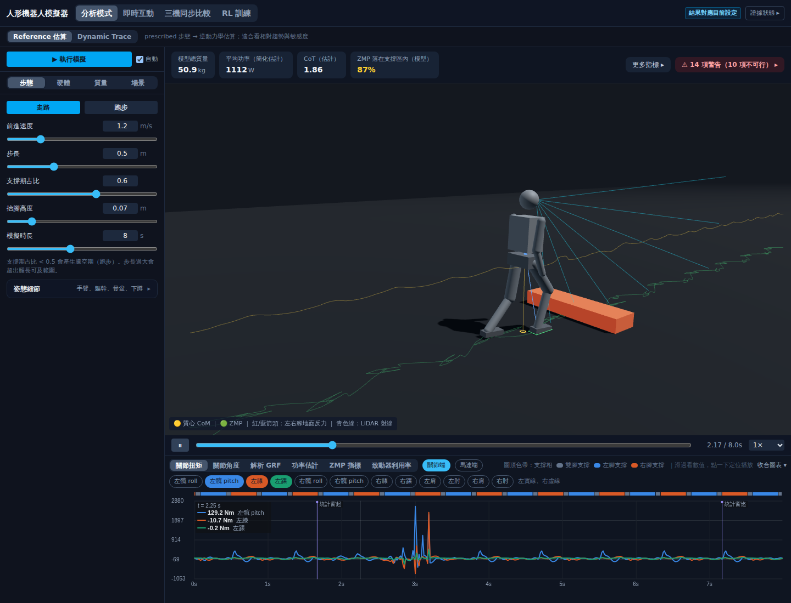
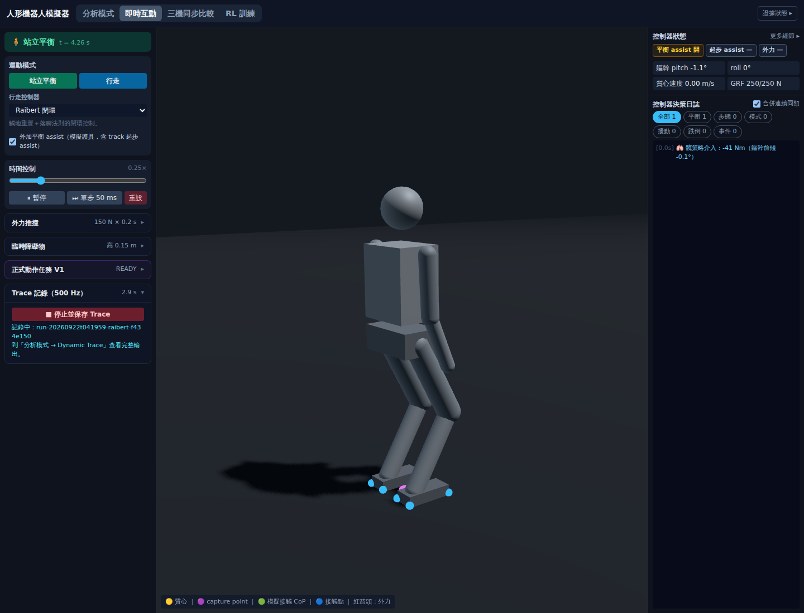
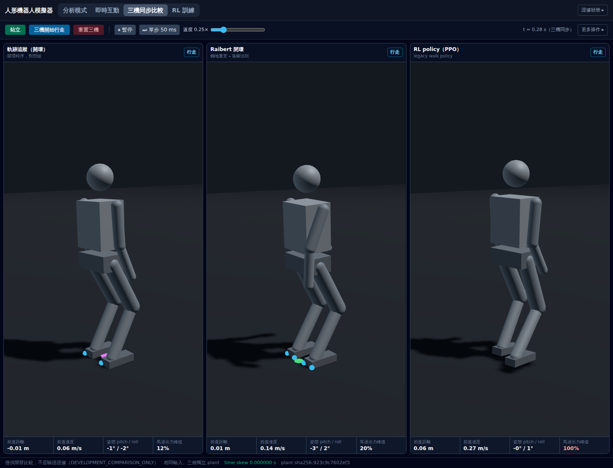
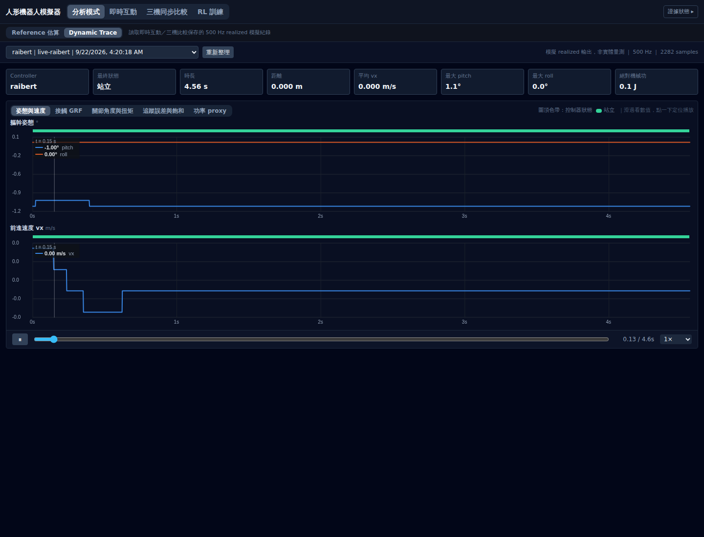
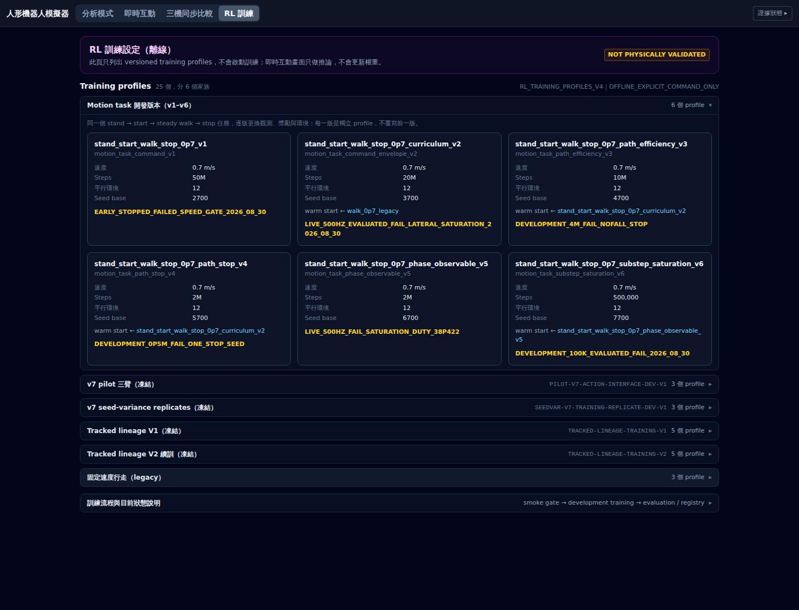

# 瀏覽器視覺驗證 receipt：五個畫面的 dedicated UI tests（`PUB-C0`）

日期：2026-09-22 ｜ ID：`BROWSER-VISUAL-VERIFICATION-2026-09-22` ｜ 任務 #104
｜ 性質：**實作 receipt 與量測**；不是 protocol、不是新的契約
｜ 上游：[ROADMAP §9 第 3 項](../ROADMAP.md)、[PUBLICATION_PLAN `PUB-C0`](../PUBLICATION_PLAN.md)
｜ 測試：[`frontend/e2e/`](../../frontend/e2e/test_browser_visual.py) ｜ 截圖：[`docs/assets/ui-2026-09-22/`](../assets/ui-2026-09-22/)

---

## 0. 一句話

**六項瀏覽器測試全過（103.82 s），五個畫面實際渲染、畫面上的數字與後端 API 對得上、console 零錯誤；
兩個 `BROWSER_VISUAL_PENDING` 解除，`PUB-C0` 由 `NOT_STARTED` 改為 `PASS`。**
「verified」的意思寫在 §4：畫面會動、數字一致、沒有錯誤——**不是** pixel regression，**不是**物理效度。

---

## 1. 測了什麼

跑在 README 的 production 路徑：`npm run build` → uvicorn 起 `backend/main.py` 的 `app`（同一個物件、同樣掛 `dist/`）
→ headless Chromium 載入 → 逐畫面操作、讀畫面、打 API 對照 → CDP `Page.captureScreenshot` 存幀 → 斷言 console／page error 為零。

| # | 測試 | 斷言 | 這次量到 |
|---|---|---|---|
| 1 | 分析模式 | 四張摘要卡出現、總質量是數字且 > 10 kg；三個圖表分頁按鈕存在；≥ 2 個 canvas（3D＋圖表）；截圖非單色 | 50.9 kg、1112 W、CoT 1.86、ZMP 87%；14 項警告（10 項不可行）如常顯示 |
| 2 | 即時互動 | WebSocket 串流：畫面上的 `t = … s` 1 s 後變大；決策日誌存在；展開「Trace 記錄」→ 開始 → 1.5 s → 停止；`/api/traces` 多**恰好一筆**、label 以 `live-` 開頭、≥ 500 samples | 錄到 `run-20260922t041959-raibert-…`，2,282 samples（4.56 s） |
| 3 | 三機同步比較 | 三個 `compare-canvas-{track,raibert,rl}`；`DEVELOPMENT_COMPARISON_ONLY` 與「相同輸入、三個獨立 plant」可見；按「三機開始行走」後 `time skew` 為 `0.000000 s`、有 `plant sha256:…`、至少一機離開站立 | skew 0.000000 s，plant `sha256:923c9c7602ef3`，三機皆進入行走 |
| 4 | Dynamic Trace | 下拉選單筆數 = `/api/traces` 筆數；選到第 2 項錄的 run；標頭 `500 Hz ｜ N samples` 的 N = API 的 `sample_count`；有圖 | 500 Hz、2,282 samples 一致 |
| 5 | RL 訓練 | `NOT PHYSICALLY VALIDATED` 可見；群組標頭「N 個 profile」加總 = `/api/training/profiles` 總數；展開所有群組後每個 `profile_id` 都在頁面上；「不會啟動訓練」可見 | 25 個 profile、6 個家族，25/25 找到 |
| 6 | 全站 | 四個分頁依序切換後 console／page error 為零；`GET /favicon.svg` 200 `image/svg+xml` | 0 錯誤 |

每個測試結束都斷言 `console.error` 與 `pageerror` 為零（測試 1–5 各自也斷言）。

### 1.1 五張截圖

| 分析模式 | 即時互動 |
|---|---|
|  |  |

| 三機同步比較 | Dynamic Trace |
|---|---|
|  |  |



---

## 2. 量測

| 項目 | 值 |
|---|---|
| 指令 | `python3 -X utf8 -m pytest frontend/e2e -p no:cacheprovider -q` |
| 結果 | **6 passed**，103.82 s（含 `npm run build` 與起後端） |
| 瀏覽器 | Chromium 1194（`/opt/pw-browsers/chromium`，Playwright 1.63.0 的 python 綁定找不到自帶版本時的退路）；`--use-gl=swiftshader`（軟體 GL） |
| 視窗 | 1440 × 1100，DPR 1 |
| 工作樹 | `71c9d71` 加上本任務的變更（e2e 測試、診斷 harness、決定紀錄、文件） |

### 2.1 到全過之前改了什麼——全是測試的選擇器，不是應用的缺陷

| 輪次 | 結果 | 原因 | 修法 |
|---|---|---|---|
| 1 | 1 error | Playwright 自帶的 Chromium 版本（1243）不在機器上 | 退到 `/opt/pw-browsers/chromium`；兩者都沒有就**失敗**，不 skip |
| 2 | 4 failed／2 passed | 分析模式等的 `data-testid=torque-ref-source` 只在特定條件渲染；即時互動的「開始記錄」在收合的 Disclosure 裡；三機比較的 footer 要等 WebSocket 第一幀；RL 訓練的家族群組預設收合、`profile_id` 不在 DOM | 改斷言 canvas 數與圖表分頁；先展開 Disclosure；等待數字型 skew；展開所有群組後再找 id |
| 3 | 1 failed／5 passed | 即時互動點 Disclosure 標頭時 Playwright 卡在 `performing click action` | 見 §3 |
| 4 | 1 failed／5 passed | 同上，`wait_for` 對「已 resolve 為 visible 的按鈕」仍逾時 | 同上 |
| 5 | **6 passed** | — | — |

---

## 3. 一個順帶量到的事：Playwright 的 actionability 等待在持續重繪的頁面上會卡住

即時互動頁的 three.js 以軟體 GL 每幀重繪。Playwright 的 `click()`／`wait_for(state="visible")` 在**已經 resolve 到可見、
enabled、stable 的元素**上仍逾時（call log 停在 `performing click action`）；同一頁的 `page.evaluate`／`inner_text`
正常。三機比較頁（三個較小的 canvas）沒有這個現象。

處置：即時互動的三個點擊改用 DOM `click()`（`page.evaluate`），並以畫面文字的出現／消失確認效果；
其餘頁面保留 Playwright 原生點擊。這與 [TEST_REPORT_2026-09-20 §4](../TEST_REPORT_2026-09-20.md) 用 CDP 取幀
避開 `screenshot()` 等待「畫面穩定」是同一類問題。

---

## 4. 「verified」在這裡的意思、以及不是什麼

| 是 | 不是 |
|---|---|
| 五個畫面在真的瀏覽器裡渲染出非空白內容 | pixel-level regression（沒有 golden image） |
| 畫面上的數字與後端 API 逐項一致（trace 筆數、sample 數、profile 數與 id、skew、plant 簽章） | 跨瀏覽器（只有 Chromium、軟體 GL） |
| 互動有效（切分頁、開始行走、錄 trace、選 trace、展開群組） | 物理效度——`feature_inventory_status` 仍是 `PROTOTYPE_FEATURES_PRESENT_UNVERIFIED`，V1–V4 無一 PASS |
| console／page error 為零 | 效能或可及性 |

`PUB-C0` 的判準是「browser visual verification + dedicated UI tests PASS」；以上就是那兩件事，所以改為 `PASS`。
Track C 其餘 gate（研究設計、倫理、學生資料、稿件）全部仍 `NOT_STARTED`。

---

## 5. 改了哪些狀態

| 位置 | 前 | 後 |
|---|---|---|
| `STATUS.yaml` `development_compare_mode_status` | `…_BROWSER_VISUAL_PENDING` | `…_BROWSER_VISUAL_VERIFIED_2026-09-22` |
| `STATUS.yaml` `dynamic_run_trace_status` | `…_BROWSER_VISUAL_PENDING` | `…_BROWSER_VISUAL_VERIFIED_2026-09-22` |
| `PUB-C0`（registry + PUBLICATION_PLAN） | `NOT_STARTED` | `PASS`，evidence 指向本 receipt |
| ROADMAP §9 第 3 項 | 待辦 | `[DONE 2026-09-22]` |
| ROADMAP §2 M2 列 | UI VERIFIED ONLY AFTER dedicated tests | dedicated tests 已存在並通過；仍非 physical validation |

---

## 6. 重現

```bash
python3 -X utf8 -m pytest frontend/e2e -p no:cacheprovider -q      # 約 100 s；會重新 build 前端
ROBOTMAN_CHROMIUM=/path/to/chrome python3 -X utf8 -m pytest frontend/e2e -q   # 指定瀏覽器
```

不在 `pytest backend/` 的集合裡（需要 Node、Chromium 與可綁定的埠）；缺任何一項都是**失敗**而非 skip。
截圖寫到 `frontend/e2e/artifacts/`（gitignored）；本 receipt 引用的五張已複製到 `docs/assets/ui-2026-09-22/`。
